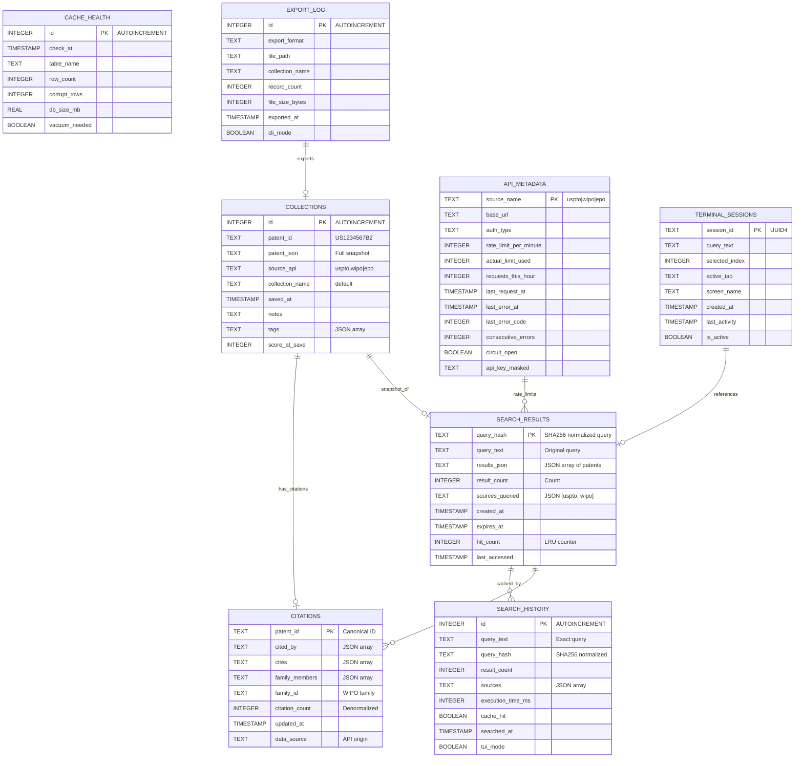

# RECON -- Database Design Document
## Data Model for Terminal-Native Patent Research Tool

**Version:** 1.0.0  
**Date:** 2026-06-21  
**Author:** Database Architect  
**Database:** SQLite (stdlib, single-file, zero-config)  
**Scale:** Small (single-user, personal workstation)  
**Expected Records:** 10K-100K search results, 1K-10K collections, 100K citations  
**Max DB Size:** 1GB (auto-vacuum threshold)

---

## 1. Design Philosophy & Constraints

### 1.1 Why SQLite

| Factor | SQLite | PostgreSQL | Decision |
|--------|--------|------------|----------|
| **Configuration** | Zero config | Requires server setup | SQLite -- no daemon, no port |
| **Deployment** | Single `.db` file | Requires installation | SQLite -- `pip install` includes everything |
| **Dependencies** | stdlib (Python 3.12+) | `psycopg2` or `asyncpg` | SQLite -- constitution mandates minimal deps |
| **Concurrency** | Single-writer | Multi-process | SQLite -- single-user tool, no concurrent writes |
| **Scale** | 1GB practical limit | Terabytes | SQLite -- personal tool, 1GB = ~1M patents |
| **JSON Support** | Native JSON1 extension | JSONB | SQLite -- sufficient for semi-structured patent data |
| **Backup** | Copy file | `pg_dump` | SQLite -- `cp cache.db backup.db` |

### 1.2 Constitutional Constraints

| Constraint | Impact on Schema |
|------------|-----------------|
| **Minimal dependencies** | No `alembic` (use raw SQL migrations); no SQLAlchemy ORM (raw SQL + dataclasses) |
| **Speed over depth** | Denormalize where query speed > storage efficiency |
| **Zero-AI default** | No vector embeddings, no ML feature stores |
| **Deterministic** | No `AUTOINCREMENT` on critical paths where IDs must be reproducible |

### 1.3 Key Design Decisions

| Decision | Rationale |
|----------|-----------|
| **JSON columns for patent data** | Patent records are semi-structured; fields vary by source (USPTO vs WIPO vs EPO). Normalizing to 30+ columns creates schema fragility when APIs change. |
| **SHA256 query_hash as cache PK** | Deterministic, collision-resistant, fixed-width. Normalized query text ensures cache hits across casing/punctuation variations. |
| **No foreign keys enforced** | SQLite FKs are optional and add overhead. Data integrity maintained in Python via `PatentRecord` dataclass validation. |
| **No soft deletes** | Personal tool; user owns all data. Hard delete is acceptable. Collections have explicit user actions (save/delete). |
| **WAL mode enabled** | Write-Ahead Logging for crash recovery; allows readers during writes. |

---

## 2. Entity List

| # | Entity | Purpose | Record Count (est.) |
|---|--------|---------|---------------------|
| 1 | **search_results** | Cache for API search responses; 30-day TTL | 10K-50K |
| 2 | **collections** | User-saved patents for export/analysis | 1K-10K |
| 3 | **citations** | Cross-reference graph: cited_by, cites, family | 50K-100K |
| 4 | **search_history** | Query log for recall and autocomplete | 5K-20K |
| 5 | **cache_health** | Corruption detection and vacuum tracking | 100-500 |
| 6 | **api_metadata** | Per-source API status: rate limits, last call, errors | 10-50 |
| 7 | **export_log** | Audit trail of exported files | 100-1K |
| 8 | **terminal_sessions** | TUI session state for crash recovery | 10-100 |

---

## 3. Full Schema Definitions

### 3.1 search_results

**Purpose:** Primary cache for patent search API responses. Query results stored as JSON blob with 30-day expiration.

| Field | Type | Constraints | Default | Description |
|-------|------|-------------|---------|-------------|
| `query_hash` | TEXT | PRIMARY KEY | -- | SHA256 of normalized query string (lowercase, trimmed, sorted params) |
| `query_text` | TEXT | NOT NULL | -- | Original query string for debugging/display |
| `results_json` | TEXT | NOT NULL | -- | JSON array of PatentRecord dicts (serialized via `json.dumps`) |
| `result_count` | INTEGER | NOT NULL, >= 0 | 0 | Number of patents in results_json |
| `sources_queried` | TEXT | NOT NULL | '[]' | JSON array of API sources used (e.g., `["uspto", "wipo"]`) |
| `created_at` | TIMESTAMP | NOT NULL | CURRENT_TIMESTAMP | When cache entry was created |
| `expires_at` | TIMESTAMP | NOT NULL | -- | CURRENT_TIMESTAMP + 30 days |
| `hit_count` | INTEGER | NOT NULL, >= 0 | 0 | Times this cache entry was served (LRU tracking) |
| `last_accessed` | TIMESTAMP | -- | NULL | Last time cache entry was read |

**Indexes:**
```sql
CREATE INDEX idx_search_results_expires ON search_results(expires_at);
CREATE INDEX idx_search_results_accessed ON search_results(last_accessed);
CREATE INDEX idx_search_results_hit_count ON search_results(hit_count);
```

**Rationale for indexes:**
- `idx_expires`: Vacuum query `DELETE FROM search_results WHERE expires_at < CURRENT_TIMESTAMP` must be fast
- `idx_accessed`: LRU eviction when DB approaches 1GB
- `idx_hit_count`: Identifies hot cache entries to preserve during vacuum

---

### 3.2 collections

**Purpose:** User-curated patent collections for export, analysis, and long-term reference. No TTL -- user explicitly saved.

| Field | Type | Constraints | Default | Description |
|-------|------|-------------|---------|-------------|
| `id` | INTEGER | PRIMARY KEY, AUTOINCREMENT | -- | Surrogate key for collection item |
| `patent_id` | TEXT | NOT NULL | -- | Canonical patent ID (e.g., `US1234567B2`) |
| `patent_json` | TEXT | NOT NULL | -- | Full PatentRecord JSON snapshot at time of save |
| `source_api` | TEXT | NOT NULL | -- | Source API: `uspto`, `wipo`, `epo`, `google`, `lens` |
| `collection_name` | TEXT | NOT NULL | 'default' | User-defined collection label |
| `saved_at` | TIMESTAMP | NOT NULL | CURRENT_TIMESTAMP | When patent was saved |
| `notes` | TEXT | -- | NULL | User notes about this patent |
| `tags` | TEXT | -- | '[]' | JSON array of user tags (e.g., `["solid-state", "battery"]`) |
| `score_at_save` | INTEGER | -- | NULL | Cross-reference score at time of save (for tracking) |

**Indexes:**
```sql
CREATE INDEX idx_collections_name ON collections(collection_name);
CREATE INDEX idx_collections_patent_id ON collections(patent_id);
CREATE INDEX idx_collections_saved_at ON collections(saved_at);
CREATE INDEX idx_collections_tags ON collections(tags);  -- FTS5 for tag search
```

**Rationale for indexes:**
- `idx_name`: `recon export --collection "my-favorites"` must filter fast
- `idx_patent_id`: Prevent duplicate saves; `SELECT * WHERE patent_id = ?`
- `idx_saved_at`: Sort by newest first in collection view
- `idx_tags`: Full-text search within tags (requires FTS5 extension)

---

### 3.3 citations

**Purpose:** Cross-reference graph for patent families, forward citations, backward citations. Populated by IntelligenceClient.

| Field | Type | Constraints | Default | Description |
|-------|------|-------------|---------|-------------|
| `patent_id` | TEXT | PRIMARY KEY | -- | Canonical patent ID |
| `cited_by` | TEXT | NOT NULL | '[]' | JSON array of patent IDs that cite this patent |
| `cites` | TEXT | NOT NULL | '[]' | JSON array of patent IDs this patent cites |
| `family_members` | TEXT | NOT NULL | '[]' | JSON array of patent IDs in same family (PCT national phases) |
| `family_id` | TEXT | -- | NULL | WIPO family ID if available |
| `citation_count` | INTEGER | NOT NULL, >= 0 | 0 | Length of `cited_by` array (denormalized for fast sorting) |
| `updated_at` | TIMESTAMP | NOT NULL | CURRENT_TIMESTAMP | Last time citation data was refreshed |
| `data_source` | TEXT | NOT NULL | -- | API source of citation data: `uspto`, `epo`, `wipo` |

**Indexes:**
```sql
CREATE INDEX idx_citations_family ON citations(family_id);
CREATE INDEX idx_citations_count ON citations(citation_count);
CREATE INDEX idx_citations_updated ON citations(updated_at);
```

**Rationale for indexes:**
- `idx_family`: Group patents by family for family view
- `idx_count`: Sort by citation count (most-cited first)
- `idx_updated`: Refresh stale citation data (>90 days)

**Denormalization Note:** `citation_count` is denormalized from `LEN(JSON_EXTRACT(cited_by, '$'))` because:
- Sorting by citation count is a common query (`ORDER BY citation_count DESC`)
- JSON array length calculation in SQLite requires `json_array_length()` which is slower than integer comparison
- Count updates are write-once (when citation data is fetched), read-many

---

### 3.4 search_history

**Purpose:** Query log for autocomplete, trend analysis, and session recovery. User can press `UP` in search box to cycle history.

| Field | Type | Constraints | Default | Description |
|-------|------|-------------|---------|-------------|
| `id` | INTEGER | PRIMARY KEY, AUTOINCREMENT | -- | Surrogate key |
| `query_text` | TEXT | NOT NULL | -- | Exact query string entered by user |
| `query_hash` | TEXT | NOT NULL | -- | SHA256 of normalized query (links to search_results) |
| `result_count` | INTEGER | -- | NULL | Number of results returned |
| `sources` | TEXT | NOT NULL | '[]' | JSON array of APIs queried |
| `execution_time_ms` | INTEGER | -- | NULL | Query execution time in milliseconds |
| `cache_hit` | BOOLEAN | NOT NULL | FALSE | Whether result came from cache |
| `searched_at` | TIMESTAMP | NOT NULL | CURRENT_TIMESTAMP | When query was executed |
| `tui_mode` | BOOLEAN | NOT NULL | FALSE | TRUE if search was from TUI, FALSE if CLI |

**Indexes:**
```sql
CREATE INDEX idx_search_history_query ON search_history(query_text);
CREATE INDEX idx_search_history_hash ON search_history(query_hash);
CREATE INDEX idx_search_history_time ON search_history(searched_at);
```

**Rationale for indexes:**
- `idx_query`: Autocomplete `LIKE 'solid%'` for search box suggestions
- `idx_hash`: Link to search_results for cache correlation analysis
- `idx_time`: Time-series queries (searches per day, trending topics)

---

### 3.5 cache_health

**Purpose:** Corruption detection, integrity monitoring, and vacuum scheduling.

| Field | Type | Constraints | Default | Description |
|-------|------|-------------|---------|-------------|
| `id` | INTEGER | PRIMARY KEY, AUTOINCREMENT | -- | Surrogate key |
| `check_at` | TIMESTAMP | NOT NULL | CURRENT_TIMESTAMP | When health check ran |
| `table_name` | TEXT | NOT NULL | -- | Table checked: `search_results`, `collections`, etc. |
| `row_count` | INTEGER | NOT NULL, >= 0 | 0 | Row count at check time |
| `corrupt_rows` | INTEGER | NOT NULL, >= 0 | 0 | Rows failing JSON validation |
| `db_size_mb` | REAL | NOT NULL, >= 0 | 0 | Database file size in MB |
| `vacuum_needed` | BOOLEAN | NOT NULL | FALSE | TRUE if db_size_mb > 1000 or corrupt_rows > 0 |

**Indexes:**
```sql
CREATE INDEX idx_cache_health_table ON cache_health(table_name, check_at);
```

---

### 3.6 api_metadata

**Purpose:** Per-source API tracking: rate limits, last successful call, error counts, key status.

| Field | Type | Constraints | Default | Description |
|-------|------|-------------|---------|-------------|
| `source_name` | TEXT | PRIMARY KEY | -- | API identifier: `uspto`, `wipo`, `epo`, `google`, `lens` |
| `base_url` | TEXT | NOT NULL | -- | API endpoint URL |
| `auth_type` | TEXT | NOT NULL | -- | `api_key`, `oauth2`, `none` |
| `rate_limit_per_minute` | INTEGER | NOT NULL, >= 0 | 0 | Documented rate limit |
| `actual_limit_used` | INTEGER | NOT NULL, >= 0 | 0 | 76% of rate_limit (24% headroom) |
| `requests_this_hour` | INTEGER | NOT NULL, >= 0 | 0 | Rolling counter (reset hourly) |
| `last_request_at` | TIMESTAMP | -- | NULL | Last successful API call |
| `last_error_at` | TIMESTAMP | -- | NULL | Last error timestamp |
| `last_error_code` | INTEGER | -- | NULL | HTTP status code of last error |
| `consecutive_errors` | INTEGER | NOT NULL, >= 0 | 0 | Error streak for circuit breaker |
| `circuit_open` | BOOLEAN | NOT NULL | FALSE | TRUE if consecutive_errors >= 5 |
| `api_key_masked` | TEXT | -- | NULL | Last 4 chars of key for identification (****XXXX) |

**Indexes:**
```sql
CREATE INDEX idx_api_metadata_circuit ON api_metadata(circuit_open);
```

**Rationale:** Circuit breaker pattern requires fast lookup of `circuit_open` status before each API call.

---

### 3.7 export_log

**Purpose:** Audit trail of exported files for compliance and reproducibility.

| Field | Type | Constraints | Default | Description |
|-------|------|-------------|---------|-------------|
| `id` | INTEGER | PRIMARY KEY, AUTOINCREMENT | -- | Surrogate key |
| `export_format` | TEXT | NOT NULL | -- | `csv`, `json`, `bibtex`, `markdown`, `pdf` |
| `file_path` | TEXT | NOT NULL | -- | Absolute path to exported file |
| `collection_name` | TEXT | -- | NULL | Source collection or NULL for full export |
| `record_count` | INTEGER | NOT NULL, >= 0 | 0 | Number of patents exported |
| `file_size_bytes` | INTEGER | -- | NULL | Size of generated file |
| `exported_at` | TIMESTAMP | NOT NULL | CURRENT_TIMESTAMP | Export timestamp |
| `cli_mode` | BOOLEAN | NOT NULL | TRUE | TRUE if CLI export, FALSE if TUI hotkey |

**Indexes:**
```sql
CREATE INDEX idx_export_log_format ON export_log(export_format, exported_at);
CREATE INDEX idx_export_log_collection ON export_log(collection_name);
```

---

### 3.8 terminal_sessions

**Purpose:** TUI session state for crash recovery. Saves search query, selected patent, active tab.

| Field | Type | Constraints | Default | Description |
|-------|------|-------------|---------|-------------|
| `session_id` | TEXT | PRIMARY KEY | -- | UUID4 generated on TUI launch |
| `query_text` | TEXT | -- | NULL | Current search query |
| `selected_index` | INTEGER | -- | NULL | Highlighted result index |
| `active_tab` | TEXT | -- | NULL | Active tab: `info`, `claims`, `image` |
| `screen_name` | TEXT | NOT NULL | 'SearchScreen' | Current screen: `SearchScreen`, `ReaderModeScreen` |
| `created_at` | TIMESTAMP | NOT NULL | CURRENT_TIMESTAMP | Session start time |
| `last_activity` | TIMESTAMP | NOT NULL | CURRENT_TIMESTAMP | Last keyboard/mouse activity |
| `is_active` | BOOLEAN | NOT NULL | TRUE | FALSE if session ended cleanly |

**Indexes:**
```sql
CREATE INDEX idx_terminal_sessions_active ON terminal_sessions(is_active, last_activity);
```

**Rationale:** On TUI crash, RECON can offer to restore: `Restore previous session? (query: "solid state battery", 3 results)`

---

## 4. Relationships

### 4.1 Relationship Table

| Entity A | Relationship | Entity B | Cardinality | Implementation |
|----------|-------------|----------|-------------|----------------|
| **search_results** | `cached_by` | **search_history** | 1:1 (optional) | `search_history.query_hash` -> `search_results.query_hash` |
| **search_results** | `contains` | **citations** | 1:N | `citations.patent_id` extracted from `search_results.results_json` |
| **collections** | `snapshot_of` | **search_results** | N:1 (optional) | `collections.patent_id` may exist in `search_results.results_json` |
| **collections** | `has_citations` | **citations** | N:1 (optional) | `collections.patent_id` -> `citations.patent_id` |
| **api_metadata** | `rate_limits` | **search_results** | 1:N (logical) | `api_metadata.source_name` in `search_results.sources_queried` |
| **export_log** | `exports` | **collections** | N:1 (optional) | `export_log.collection_name` -> `collections.collection_name` |
| **terminal_sessions** | `references` | **search_results** | N:1 (optional) | `terminal_sessions.query_text` -> `search_results.query_text` |

### 4.2 Relationship Notes

- **No enforced foreign keys.** All relationships are logical, maintained by application code. This is intentional -- SQLite FK enforcement is optional and adds overhead; the single-process Python application maintains integrity via dataclass validation.
- **search_results <-> search_history:** A cache entry may exist without history (pre-warmed) and history may exist without cache (if user ran with `--no-cache`).
- **collections <-> search_results:** Collections store a JSON snapshot at save time. If the cache expires, the collection still has full patent data. This is denormalization by design -- collections must survive cache eviction.

---

## 5. ERD (Entity Relationship Diagram)



---

## 6. Indexes

### 6.1 Complete Index Inventory

| Table | Index Name | Fields | Type | Purpose |
|-------|-----------|--------|------|---------|
| search_results | `idx_expires` | `expires_at` | B-tree | Fast vacuum of expired entries |
| search_results | `idx_accessed` | `last_accessed` | B-tree | LRU eviction ordering |
| search_results | `idx_hit_count` | `hit_count DESC` | B-tree | Hot entry identification |
| collections | `idx_collection_name` | `collection_name` | B-tree | Filter by collection |
| collections | `idx_patent_id` | `patent_id` | B-tree | Deduplication check |
| collections | `idx_saved_at` | `saved_at DESC` | B-tree | Sort newest first |
| collections | `idx_tags` | `tags` | FTS5 | Full-text search on tags |
| citations | `idx_family` | `family_id` | B-tree | Family grouping |
| citations | `idx_count` | `citation_count DESC` | B-tree | Sort by citation count |
| citations | `idx_updated` | `updated_at` | B-tree | Stale data refresh |
| search_history | `idx_query` | `query_text` | B-tree | Autocomplete LIKE queries |
| search_history | `idx_hash` | `query_hash` | B-tree | Cache correlation |
| search_history | `idx_time` | `searched_at DESC` | B-tree | Time-series analysis |
| cache_health | `idx_health_table` | `table_name, check_at DESC` | B-tree | Per-table health history |
| api_metadata | `idx_circuit` | `circuit_open` | B-tree | Circuit breaker check |
| export_log | `idx_export_format` | `export_format, exported_at DESC` | B-tree | Filter by format |
| export_log | `idx_export_collection` | `collection_name` | B-tree | Filter by collection |
| terminal_sessions | `idx_session_active` | `is_active, last_activity DESC` | B-tree | Active session lookup |

### 6.2 Index Justification

**Why no composite indexes?**
- SQLite query planner handles single-column indexes well for the expected query patterns
- Composite indexes add write overhead; write patterns (cache insert) are more frequent than complex reads
- If profiling reveals slow queries, composite indexes can be added as migration

**Why FTS5 for tags?**
- `collections.tags` is a JSON array. SQLite's FTS5 extension provides full-text search over text content
- Alternative: `json_each()` table-valued function is slower for frequent searches
- FTS5 is included in Python's standard SQLite build (since Python 3.12)

---

## 7. Soft Delete Strategy

### 7.1 Decision: NO Soft Deletes

RECON does **not** implement soft deletes. Rationale:

| Factor | Assessment |
|--------|------------|
| **User ownership** | Single-user tool; user owns all data. No admin needs to recover deleted data. |
| **Legal requirements** | No GDPR, CCPA, or audit requirements for personal research tool |
| **Storage cost** | Hard deletes reclaim space immediately (VACUUM); soft deletes bloat DB |
| **Complexity** | Soft deletes require `WHERE deleted_at IS NULL` on every query; error-prone |
| **Undo capability** | Collections can be re-saved from search results; not critical data |

### 7.2 Hard Delete Patterns

```sql
-- Delete single collection item
DELETE FROM collections WHERE id = ?;

-- Delete entire collection
DELETE FROM collections WHERE collection_name = ?;

-- Vacuum expired cache (automated)
DELETE FROM search_results WHERE expires_at < CURRENT_TIMESTAMP;

-- Vacuum old search history (>1 year)
DELETE FROM search_history WHERE searched_at < datetime('now', '-1 year');
```

### 7.3 Accidental Delete Mitigation

| Feature | Implementation |
|---------|---------------|
| **TUI confirmation** | `Delete "US1234567" from collection? (y/n)` before DELETE |
| **Export before delete** | Prompt user to export collection before bulk delete |
| **SQLite backups** | User can `cp cache.db cache.db.backup` before risky operations |

---

## 8. Timestamps Convention

### 8.1 Timestamp Rules

| Rule | Implementation |
|------|---------------|
| **Timezone** | All timestamps stored in **UTC** (`CURRENT_TIMESTAMP` in SQLite is UTC) |
| **Precision** | Second-level precision (`YYYY-MM-DD HH:MM:SS`) |
| **Format** | ISO 8601: `2026-06-21T20:45:00Z` |
| **Display** | Converted to local timezone in TUI via Python `datetime` |
| **Defaults** | `CURRENT_TIMESTAMP` for creation; explicit update for modifications |

### 8.2 Timestamp Fields by Table

| Table | Created | Modified | Accessed | Expires |
|-------|---------|----------|----------|---------|
| search_results | `created_at` | -- | `last_accessed` | `expires_at` |
| collections | `saved_at` | -- | -- | -- |
| citations | -- | `updated_at` | -- | -- |
| search_history | `searched_at` | -- | -- | -- |
| cache_health | `check_at` | -- | -- | -- |
| api_metadata | -- | `last_request_at`, `last_error_at` | -- | -- |
| export_log | `exported_at` | -- | -- | -- |
| terminal_sessions | `created_at` | `last_activity` | -- | -- |

---

## 9. Denormalization Decisions

### 9.1 Denormalization Inventory

| Table | Denormalized Field | Source | Justification | Trade-off |
|-------|-------------------|--------|---------------|-----------|
| **search_results** | `result_count` | `LEN(JSON_EXTRACT(results_json, '$'))` | Avoid JSON parsing on cache hit validation | Write overhead: update on every cache insert |
| **citations** | `citation_count` | `LEN(JSON_EXTRACT(cited_by, '$'))` | Fast `ORDER BY citation_count DESC` | Write overhead: update when citation data refreshed |
| **collections** | `patent_json` (snapshot) | `search_results.results_json` | Collections must survive cache eviction | Storage bloat: duplicate data; 10K collections = ~50MB extra |
| **search_history** | `query_hash` | `SHA256(normalized query_text)` | Fast join to search_results without re-computing hash | Minor storage overhead: 64 chars per row |
| **api_metadata** | `actual_limit_used` | `rate_limit_per_minute * 0.76` | Avoid runtime calculation on every rate limit check | Must update if headroom % changes |

### 9.2 Denormalization Justification Framework

Denormalization is permitted when ALL of the following are true:

1. **Read frequency >> Write frequency** (e.g., citation_count read on every sort, written once per refresh)
2. **Computation cost > Storage cost** (e.g., JSON parsing is O(n) where n = patent count)
3. **Write path is centralized** (e.g., only `CacheDatabase.save_search_results()` writes `result_count`)
4. **Inconsistency window is acceptable** (e.g., citation_count may be stale for 90 days)

### 9.3 When to Re-normalize

If the following conditions occur, denormalized fields should be removed:

- Storage bloat exceeds 50% of DB size
- Write amplification causes >20% performance degradation
- Inconsistency bugs are reported by users

---

## 10. Migration Strategy

### 10.1 No Migration Tool (By Design)

RECON does **not** use Alembic, Django Migrations, or any ORM migration framework. Rationale:

| Factor | Assessment |
|--------|------------|
| **Dependency cost** | Alembic adds `SQLAlchemy` + `alembic` (~5MB); violates minimal dependency constitution |
| **Schema stability** | 8 tables, simple schema; changes are rare (quarterly, not daily) |
| **User impact** | Single-user tool; migrations run once per user per version upgrade |
| **Complexity** | Raw SQL migrations are maintainable for <20 tables |

### 10.2 Migration Pattern: Versioned SQL Files

```
recon/migrations/
├── __init__.py
├── v0_1_0_initial.sql
├── v0_2_0_add_api_metadata.sql
├── v0_3_0_add_terminal_sessions.sql
└── migrate.py  # Simple runner
```

### 10.3 Migration Runner

```python
# storage/migrate.py -- Simple migration runner
import sqlite3
import os
from pathlib import Path

MIGRATIONS = [
    ("0.1.0", "v0_1_0_initial.sql"),
    ("0.2.0", "v0_2_0_add_api_metadata.sql"),
    ("0.3.0", "v0_3_0_add_terminal_sessions.sql"),
]

def migrate(db_path: str, target_version: str):
    conn = sqlite3.connect(db_path)
    conn.execute("CREATE TABLE IF NOT EXISTS schema_version (version TEXT PRIMARY KEY)")

    current = conn.execute("SELECT version FROM schema_version ORDER BY version DESC LIMIT 1").fetchone()
    current = current[0] if current else "0.0.0"

    for version, filename in MIGRATIONS:
        if version > current:
            sql = Path(__file__).parent / "migrations" / filename
            conn.executescript(sql.read_text())
            conn.execute("INSERT OR REPLACE INTO schema_version (version) VALUES (?)", (version,))
            conn.commit()
            print(f"Migrated to {version}")

    conn.close()
```

### 10.4 Migration File Example

```sql
-- migrations/v0_2_0_add_api_metadata.sql
-- Add api_metadata table for rate limiting and circuit breaker

CREATE TABLE IF NOT EXISTS api_metadata (
    source_name TEXT PRIMARY KEY,
    base_url TEXT NOT NULL,
    auth_type TEXT NOT NULL,
    rate_limit_per_minute INTEGER NOT NULL DEFAULT 0,
    actual_limit_used INTEGER NOT NULL DEFAULT 0,
    requests_this_hour INTEGER NOT NULL DEFAULT 0,
    last_request_at TIMESTAMP,
    last_error_at TIMESTAMP,
    last_error_code INTEGER,
    consecutive_errors INTEGER NOT NULL DEFAULT 0,
    circuit_open BOOLEAN NOT NULL DEFAULT FALSE,
    api_key_masked TEXT
);

CREATE INDEX IF NOT EXISTS idx_api_metadata_circuit ON api_metadata(circuit_open);

-- Migrate existing data: populate from config
INSERT INTO api_metadata (source_name, base_url, auth_type, rate_limit_per_minute, actual_limit_used)
VALUES 
    ('uspto', 'https://api.uspto.gov/api/v1', 'api_key', 100, 76),
    ('wipo', 'https://patentscope.wipo.int', 'none', 100, 76),
    ('epo', 'https://ops.epo.org', 'oauth2', 240, 182);

-- Update schema version
INSERT OR REPLACE INTO schema_version (version) VALUES ('0.2.0');
```

### 10.5 Backward Compatibility

| Scenario | Strategy |
|----------|----------|
| **New table added** | Existing code ignores unknown tables; no breakage |
| **New column added** | `DEFAULT` value ensures old rows are valid |
| **Column renamed** | Migration creates new column, copies data, drops old; or use `ALTER TABLE RENAME COLUMN` (SQLite 3.25+) |
| **Table dropped** | Rare; requires major version bump and user notification |

### 10.6 Data Integrity During Migration

```python
# Pre-migration backup
def backup_before_migration(db_path: str):
    backup_path = f"{db_path}.backup.{datetime.now().strftime('%Y%m%d_%H%M%S')}"
    shutil.copy2(db_path, backup_path)
    return backup_path

# Post-migration validation
def validate_migration(conn: sqlite3.Connection):
    # Check all tables exist
    tables = ['search_results', 'collections', 'citations', 'search_history', 
              'cache_health', 'api_metadata', 'export_log', 'terminal_sessions']
    for table in tables:
        count = conn.execute(f"SELECT COUNT(*) FROM sqlite_master WHERE name = ?", (table,)).fetchone()[0]
        assert count == 1, f"Table {table} missing after migration"

    # Check JSON validity in sample rows
    sample = conn.execute("SELECT results_json FROM search_results LIMIT 10").fetchall()
    for row in sample:
        json.loads(row[0])  # Raises if invalid JSON

    print("Migration validation passed")
```

---

## 11. Query Patterns

### 11.1 Hot Queries (Optimized)

```sql
-- Q1: Cache lookup (most frequent)
SELECT results_json, result_count 
FROM search_results 
WHERE query_hash = ? AND expires_at > CURRENT_TIMESTAMP;
-- Uses: PRIMARY KEY (query_hash) -- O(1) lookup

-- Q2: Vacuum expired entries (daily cron)
DELETE FROM search_results WHERE expires_at < CURRENT_TIMESTAMP;
-- Uses: idx_expires -- range scan

-- Q3: Collection export
SELECT patent_json FROM collections WHERE collection_name = ? ORDER BY saved_at DESC;
-- Uses: idx_collection_name -- O(log n) filter + sort

-- Q4: Citation sort
SELECT patent_id, citation_count FROM citations ORDER BY citation_count DESC LIMIT 50;
-- Uses: idx_count -- covering index

-- Q5: Search history autocomplete
SELECT query_text FROM search_history 
WHERE query_text LIKE ? || '%' AND searched_at > datetime('now', '-30 days')
ORDER BY searched_at DESC LIMIT 10;
-- Uses: idx_query + idx_time -- range scan + sort

-- Q6: Circuit breaker check
SELECT circuit_open FROM api_metadata WHERE source_name = ?;
-- Uses: PRIMARY KEY (source_name) -- O(1)
```

### 11.2 Slow Queries (Acceptable)

```sql
-- Q7: Full-text tag search (rare)
SELECT * FROM collections WHERE tags MATCH 'battery';
-- Uses: FTS5 idx_tags -- fast but FTS5 has startup cost

-- Q8: Cross-table family lookup
SELECT c.*, ci.family_members 
FROM collections c
LEFT JOIN citations ci ON c.patent_id = ci.patent_id
WHERE c.collection_name = ?;
-- No FK; JOIN on patent_id (TEXT) -- O(n log n) with index
```

---

## 12. Performance Projections

### 12.1 Storage Estimates

| Table | Row Size | 1K Rows | 10K Rows | 100K Rows |
|-------|----------|---------|----------|-----------|
| search_results | ~5KB (JSON blob) | 5MB | 50MB | 500MB |
| collections | ~3KB (JSON snapshot) | 3MB | 30MB | 300MB |
| citations | ~2KB (JSON arrays) | 2MB | 20MB | 200MB |
| search_history | ~200B | 200KB | 2MB | 20MB |
| Others | ~100B | 100KB | 1MB | 10MB |
| **Total** | -- | **~10MB** | **~100MB** | **~1GB** |

### 12.2 Query Performance Targets

| Query | Target | With Indexes | Without Indexes |
|-------|--------|------------|-----------------|
| Cache hit (PK lookup) | <1ms | 0.5ms | 50ms (full scan) |
| Vacuum expired | <100ms | 20ms | 500ms (full scan) |
| Collection filter | <5ms | 2ms | 100ms (full scan) |
| Citation sort | <10ms | 5ms | 200ms (sort + scan) |
| History autocomplete | <20ms | 10ms | 300ms (LIKE scan) |

---

## 13. Backup & Recovery

### 13.1 Backup Strategy

| Method | Frequency | Command | Size |
|--------|-----------|---------|------|
| **File copy** | On demand | `cp cache.db cache.db.backup` | Same as DB |
| **Export collections** | Weekly | `recon export --format json` | ~3MB per 1K patents |
| **SQLite .dump** | Monthly | `sqlite3 cache.db .dump > backup.sql` | Text, compressible |

### 13.2 Recovery Procedures

| Scenario | Recovery |
|----------|----------|
| **Corrupt cache entry** | Delete single row, re-fetch from API |
| **Corrupt database** | Restore from `.backup` file; re-run search to rebuild cache |
| **Lost collections** | Restore from JSON export; re-import |
| **Schema mismatch** | Run migration runner; validates before applying |

---

## Document Control

| Version | Date | Author | Changes |
|---------|------|--------|---------|
| 0.1.0 | 2026-05-12 | DB Architect | Initial schema design |
| 0.2.0 | 2026-05-16 | DB Architect | Added api_metadata, circuit breaker pattern |
| 1.0.0 | 2026-06-21 | DB Architect | Complete redesign with 8 entities, FTS5, denormalization justification, migration strategy |

**Next Review:** Upon schema change request or performance regression >2x target latency.
