# RECON -- Technical Architecture Document
## Terminal-Native Patent Research Tool (Web-Scraper Default Architecture)

**Version:** 2.0.0  
**Date:** 2026-06-23  
**Author:** Lead Technical Architect  
**Status:** Architecture Pivot (v2.0.0)  
**Deployment Target:** PyPI package (local installation)  
**Scale Expectation:** Single-user, personal workstation; ~10-100 queries/day per user

---

## 1. System Overview & Goals

RECON is a **single-user, local-first, terminal-native application** for patent research. It is not a web service, SaaS platform, or client-server architecture. The entire application runs as a single Python process on the user's machine, making concurrent HTTP requests to **web-scraped sources by default** (DuckDuckGo, Google Patents), caching results aggressively in SQLite, and rendering output either as rich terminal tables (CLI mode) or as an interactive Textual TUI.

### Architectural Goals

| Goal | Priority | Rationale |
|------|----------|-----------|
| **Zero-latency local operation** | P0 | No network round-trip to a backend server; user types query, results appear in terminal immediately from aggressive SQLite cache |
| **Zero recurring cost** | P0 | No infrastructure to host; user installs via `pip`, runs locally; primary sources are free (scraped), APIs are optional |
| **Deterministic reproducibility** | P0 | Same query -> same results -> same ordering, every time, on every machine |
| **Zero-AI default** | P0 | No opaque ML ranking; transparent scoring algorithm auditable in source code |
| **Scraper resilience** | P0 | Aggressive caching, randomized delays, rotating User-Agents, limited concurrency -- all mandatory for web-scraper sources |
| **Minimal dependency footprint** | P1 | `pip install recon` pulls only essential packages; no Docker, no Node.js, no PostgreSQL |
| **Offline resilience** | P1 | 30-day cache allows full search history and saved collections without network |

### Architecture Pattern: **Layered Monolith (Local Process)**

RECON follows a strict layered architecture within a single OS process:

1. **Presentation Layer:** Typer (CLI) + Textual (TUI)
2. **Application Layer:** Search orchestration, export logic, config management
3. **Domain Layer:** Patent models, scoring algorithm, cross-reference intelligence
4. **Infrastructure Layer:** HTTP scraping clients, optional API clients, SQLite cache, file system exports

There are no network boundaries between layers. All communication is in-process Python function calls.

### What This Is NOT

- **Not a web application.** There is no HTTP server, no REST API, no JavaScript frontend.
- **Not a SaaS.** There is no user authentication service, no multi-tenancy, no cloud database.
- **Not a microservices architecture.** The entire system is a single Python package with internal modules.
- **Not an AI/LLM product.** No inference engine, no vector database, no embedding model.

---

## 2. High-Level Architecture Diagram

```mermaid
flowchart TB
    subgraph UserSpace["User Workstation (Single Process)"]
        direction TB

        subgraph CLI_Entry["CLI Entry Layer"]
            Typer["typer CLI Parser<br/>cli/main.py"]
        end

        subgraph TUI_Layer["TUI Layer"]
            TextualApp["Textual App<br/>tui/app.py"]
            SearchScreen["SearchScreen<br/>tui/screens.py"]
            ReaderScreen["ReaderModeScreen<br/>tui/screens.py"]
            Widgets["Widgets: ResultList, InfoTab,<br/>ClaimsTab, ImageTab<br/>tui/widgets/"]
        end

        subgraph Core_Layer["Core Business Logic"]
            SearchEngine["Search Engine<br/>core/search.py"]
            Scoring["Scoring Engine<br/>core/scoring.py"]
            Models["Data Models<br/>core/models.py"]
            Config["Config Manager<br/>core/config.py"]
        end

        subgraph Scraper_Layer["Default Scraper Clients (Phase 1)"]
            BaseScraper["Base Scraper<br/>clients/base_scraper.py"]
            DDG["DuckDuckGo Client<br/>clients/scrapers.py<br/>(via duckduckgo_search)"]
            Google["Google Patents Client<br/>clients/scrapers.py<br/>(via beautifulsoup4)"]
            WIPO["WIPO Client<br/>clients/scrapers.py<br/>(mixed scrape/API)"]
            USPTO["USPTO Client<br/>clients/scrapers.py<br/>(open API, no key)"]
            Intel["IntelligenceClient<br/>clients/intelligence.py"]
        end

        subgraph API_Layer["Optional API Clients (Phase 3)"]
            EPO["EPOClient (OAuth)<br/>clients/patent_apis.py"]
            Lens["LensOrgClient<br/>clients/patent_apis.py"]
        end

        subgraph Storage_Layer["Local Storage"]
            SQLite[("SQLite<br/>~/.local/share/recon/cache.db")]
            ConfigFile[("TOML Config<br/>~/.config/recon/config.toml")]
            ExportFiles[("Export Files<br/>./collection_export.*")]
        end
    end

    subgraph External["External Services (Rate-Limited)"]
        DDG_SCRAPE["DuckDuckGo (scraped via ddgs)"]
        GOOGLE_SCRAPE["Google Patents (scraped HTML)"]
        WIPO_SCRAPE["WIPO PATENTSCOPE"]
        USPTO_API["USPTO Open Data Portal"]
        EPO_API["EPO Open Patent Services (opt-in)"]
        LENS_API["Lens.org API (opt-in)"]
        NIH["NIH RePORTER"]
        NSF["NSF Awards"]
        SEC["SEC EDGAR"]
        OPENALEX["OpenAlex"]
        ARXIV["arXiv"]
        OPENCORP["OpenCorporates"]
    end

    Typer --> SearchEngine
    Typer --> Config

    TextualApp --> SearchScreen
    TextualApp --> ReaderScreen
    SearchScreen --> Widgets
    SearchScreen --> SearchEngine
    ReaderScreen --> Models

    SearchEngine --> Scoring
    SearchEngine --> Scraper_Layer
    SearchEngine --> API_Layer
    SearchEngine --> SQLite
    Scoring --> Models
    Config --> ConfigFile

    BaseScraper --> DDG
    BaseScraper --> Google
    BaseScraper --> WIPO
    BaseScraper --> USPTO
    DDG --> DDG_SCRAPE
    Google --> GOOGLE_SCRAPE
    WIPO --> WIPO_SCRAPE
    USPTO --> USPTO_API
    Intel --> NIH
    Intel --> NSF
    Intel --> SEC
    Intel --> OPENALEX
    Intel --> ARXIV
    Intel --> OPENCORP

    EPO --> EPO_API
    Lens --> LENS_API

    SearchEngine --> SQLite
    Widgets --> SQLite
    Typer --> ExportFiles

    style UserSpace fill:#1a1a2e,stroke:#16213e,stroke-width:2px,color:#fff
    style External fill:#0f3460,stroke:#16213e,stroke-width:2px,color:#fff
    style SQLite fill:#e94560,stroke:#16213e,stroke-width:2px,color:#fff
    style ConfigFile fill:#e94560,stroke:#16213e,stroke-width:2px,color:#fff
    style Scraper_Layer fill:#2d6a4f,stroke:#1b4332,stroke-width:2px,color:#fff
    style API_Layer fill:#7b2d26,stroke:#5c1a15,stroke-width:2px,color:#fff
```



**Layout Note:** The green `Scraper_Layer` block contains the **default** intelligence engines (Phase 1). The red `API_Layer` block contains **opt-in** power-user API clients (Phase 3). Users without API keys operate entirely within the scraper layer.

---

## 3. Component Breakdown

### 3.1 CLI Entry Layer (`cli/`)

| Module | Responsibility | Key Classes/Functions |
|--------|---------------|----------------------|
| `cli/main.py` | Typer application root, command routing, argument parsing | `typer.Typer()` app, `search()`, `export()`, `config()` |
| `cli/export.py` | Format-specific export logic | `export_csv()`, `export_json()`, `export_bibtex()`, `export_markdown()`, `export_pdf()` |
| `cli/download.py` | Patent document download queue | `queue_download()`, `process_downloads()` |

**Architectural Decision:** Typer was chosen over `argparse` because it generates automatic `--help` text, handles type conversion, and produces a polished CLI experience with minimal boilerplate. For a tool with 3+ subcommands (`search`, `export`, `config`), Typer reduces CLI maintenance burden by 60% compared to argparse.

### 3.2 TUI Layer (`tui/`)

| Module | Responsibility | Key Classes |
|--------|---------------|-------------|
| `tui/app.py` | Textual application bootstrap, CSS loading, screen routing | `ReconApp(Textual.App)` |
| `tui/screens.py` | Screen definitions: SearchScreen, ReaderModeScreen | `SearchScreen`, `ReaderModeScreen` |
| `tui/widgets/result_list.py` | Patent result list with keyboard navigation | `ResultList(ListView)` |
| `tui/widgets/info_tab.py` | Patent metadata display | `InfoTab(Static)` |
| `tui/widgets/claims_tab.py` | Lazy-loaded claims text | `ClaimsTab(Static)` |
| `tui/widgets/image_tab.py` | Terminal image rendering | `ImageTab(Static)` |

**Architectural Decision:** Textual was chosen over `rich` (standalone), `curses`, `urwid`, or `prompt_toolkit` because:
- It provides a React-like component model with reactive updates
- Built-in CSS-like styling system (`tui/app.py` contains CSS)
- Automatic keyboard focus management and event bubbling
- First-class async support (`async def on_key`)
- Active maintenance and Python 3.12+ compatibility

**Trade-off:** Textual is heavier than `curses` (adds ~50MB to venv) and requires a modern terminal emulator. This is acceptable because the target user (technology builder) already uses Kitty/iTerm2/WezTerm.

### 3.3 Core Business Logic (`core/`)

| Module | Responsibility | Key Classes/Functions |
|--------|---------------|----------------------|
| `core/search.py` | Search orchestration: dispatch to scrapers/APIs, aggregate, sort, deduplicate | `search_patents()`, `sort_and_merge_results()` |
| `core/scoring.py` | Deterministic cross-reference scoring | `calculate_score()`, `entity_match()` |
| `core/models.py` | Domain models: PatentRecord, CrossReference | `PatentRecord` (dataclass), `CrossReference` (dataclass) |
| `core/config.py` | TOML config read/write | `Config.load()`, `Config.save()` |
| `core/intelligence.py` | Cross-reference signal aggregation | `IntelligenceClient` |
| `core/translation.py` | Non-English patent translation (v1.5+) | `translate_abstract()` |
| `core/arbitrage.py` | Multi-source result deduplication | `merge_duplicates()` |

**Architectural Decision:** Pure Python `dataclasses` are used instead of Pydantic or `attrs` to eliminate a dependency. The constitution mandates minimal dependencies. Type hints provide static analysis benefits without runtime overhead.

### 3.4 Default Scraper Clients (`clients/`)

| Module | Responsibility | Key Classes |
|--------|---------------|-------------|
| `clients/base_scraper.py` | Shared `httpx.AsyncClient`, randomized delays, rotating User-Agent, rate-limit enforcement | `BaseScraper`, `get_with_backoff()`, `ROTATING_USER_AGENTS` |
| `clients/scrapers.py` | Source-specific scrapers: DuckDuckGo, Google Patents, WIPO, USPTO | `DuckDuckGoClient`, `GooglePatentsClient`, `WIPOClient`, `USPTOClient` |
| `clients/patent_apis.py` | **Opt-in** API clients: EPO, Lens.org (Phase 3 only) | `EPOClient`, `LensOrgClient` |
| `clients/intelligence.py` | Cross-reference data sources | `IntelligenceClient` |

**Architectural Decision:** All scraper clients inherit from `BaseScraper` which enforces:
- **Singleton `httpx.AsyncClient`:** Reused across scrapes to enable HTTP/2 connection pooling and TCP keep-alive.
- **Randomized sleep delays (1-3s):** Mandatory jitter between concurrent background requests to evade rate-limit detection.
- **Rotating User-Agent pool:** Each request picks a random User-Agent from a curated list of modern browser strings.
- **Max 2 concurrent workers for DDG:** DuckDuckGo aggressively bans scrapers; concurrency is intentionally capped.
- **Aggressive SQLite caching:** Every scrape result is cached with 30-day TTL. Repeated identical queries never touch the network.
- **No exponential backoff on 429:** For scrapers, a 429 means "stop scraping this source for this session" -- fall back to cache or skip silently.

### 3.5 Local Storage (`storage/`)

| Module | Responsibility | Key Classes |
|--------|---------------|-------------|
| `storage/cache.py` | SQLite schema, CRUD, TTL enforcement | `CacheDatabase` |

**Tables:**
- `search_results`: query_hash -> JSON result array, created_at, expires_at
- `collections`: id -> JSON PatentRecord, saved_at
- `citations`: patent_id -> cited_by array, family_members array
- `search_history`: query string, timestamp, result_count

---

## 4. Data Flow

### 4.1 CLI Search Flow (Cold Cache, Default Scrapers)

```
User: recon search "solid state battery"
  |
  v
[Typer] Parse arguments -> invoke search_patents(query="solid state battery")
  |
  v
[Config] Load ~/.config/recon/config.toml -> check for API keys
  |       └── No API keys found -> use default scrapers (DDG + Google + WIPO + USPTO)
  |
  v
[CacheDatabase] SELECT * FROM search_results WHERE query_hash = SHA256("solid state battery")
  |   └── Cache miss (cold)
  |
  v
[SearchEngine] Build query params -> dispatch 4 concurrent scraper tasks
  |
  |---> [DuckDuckGoClient] ddgs.text(query, max_results=10)
  |       |---> Rate limit guard: max 2 concurrent threads
  |       |---> Random sleep (1-3s) before request
  |       |---> Random User-Agent selected
  |       |---> HTTP 200 -> parse results -> list[PatentRecord]
  |       └──> HTTP 429 -> log warning, return empty, fall back to cache
  |
  |---> [GooglePatentsClient] GET patents.google.com/?q=...
  |       |---> Random sleep (1-3s) before request
  |       |---> beautifulsoup4 parse HTML -> extract patent cards
  |       |---> Normalize to PatentRecord
  |       └──> HTML structure change -> fallback parser
  |
  |---> [WIPOClient] GET patentscope.wipo.int/search/...
  |       └──> Parse HTML/JSON -> list[PatentRecord]
  |
  └──> [USPTOClient] GET api.uspto.gov/v1/patent/applications/search?q=...
          └──> HTTP 200 -> parse JSON -> list[PatentRecord]
  |
  v
[SearchEngine] Merge result lists -> deduplicate by patent family
  |
  v
[ScoringEngine] For each result, query IntelligenceClient:
  |       |-- NIH RePORTER: grant matches? (+20)
  |       |-- NSF Awards: funding matches? (+20)
  |       |-- SEC EDGAR: assignee filing matches? (+20)
  |       |-- OpenAlex: paper citations? (+20)
  |       |-- arXiv: preprint matches? (+20)
  |       └── OpenCorporates: corporate entity match? (+20)
  |       └── Sum signals -> score (max 100)
  |
  v
[SearchEngine] Sort by score descending -> stable sort by date secondary
  |
  v
[CacheDatabase] INSERT search_results (query_hash, json_data, expires_at=NOW+30days)
  |
  v
[CLI Export] rich.table.Table -> render 3 patents with metadata
  |
  v
User sees formatted table in terminal
```

**Latency budget (cold cache, 4 scrapers):**
- Config load: ~5ms
- Cache miss: ~2ms
- **Mandatory random sleep (DDG): ~2000ms** (1-3s jitter, average 2s)
- Google Patents scrape: ~1500ms (HTML parse heavy)
- WIPO scrape: ~1200ms
- USPTO API: ~800ms
- Concurrent dispatch with staggered sleep: max(2000, 1500, 1200, 800) = ~2000ms
- Merge + deduplicate: ~10ms
- Scoring (6 signals x 50 patents): ~300ms
- Sort: ~5ms
- Cache write: ~20ms
- Render: ~50ms
- **Total: ~2.7s** (under 3s warm target, under 8s cold target)

### 4.2 TUI Search Flow (Warm Cache)

```
User: recon search (no args)
  |
  v
[Textual] Mount SearchScreen -> render search input + empty ResultList
  |
  v
User types "solid state battery" -> presses Enter
  |
  v
[SearchScreen.on_input_submitted] -> SearchEngine.search_patents()
  |
  v
[CacheDatabase] Cache hit -> SELECT json_data (50 results)
  |
  v
[SearchEngine] Deserialize JSON -> list[PatentRecord] (~20ms)
  |
  v
[ResultList] Populate ListView with 50 ListItems (~30ms)
  |
  v
User presses DOWN to highlight first patent
  |
  v
[ResultList.on_highlighted] -> SearchScreen._current_record()
  |
  v
[InfoTab] update() with patent metadata (instant, no API call)
  |
  v
User presses l (next tab)
  |
  v
[SearchScreen.on_tabbed_content_tab_activated] tab_id="claims"
  |
  v
[ClaimsTab] Lazy load: if not loaded, fetch claims from cache or scraper
  |       └── Cache hit -> render claims text (~50ms)
  |
  v
User presses l again (image tab)
  |
  v
[ImageTab] Detect terminal protocol:
  |       |-- Kitty? -> render sixel/kitty graphics
  |       |-- iTerm2? -> render inline image protocol
  |       |-- Sixel? -> render sixel sequence
  |       └── Fallback -> show URL + xdg-open hint
  |
  v
User presses s (save)
  |
  v
[CacheDatabase] INSERT INTO collections (json_data) -> notify("Saved US1234567")
```

**Latency budget (warm cache, TUI):**
- Search input -> cache read: ~25ms
- ResultList populate: ~30ms
- Highlight -> InfoTab: ~5ms
- Tab switch -> Claims (lazy): ~50ms
- **Total per interaction: <100ms** (meets NFR-003)

---

## 5. Tech Stack Justification

### 5.1 Core Dependencies

| Package | Version | Role | Why This Tool |
|---------|---------|------|---------------|
| **Python** | >=3.12 | Runtime | Pattern matching, improved `asyncio`, `tomllib` (stdlib TOML parser), better error messages |
| **textual** | ^0.x | TUI framework | Only mature Python TUI framework with CSS-like styling, reactive components, and async event handling. `urwid` is unmaintained; `curses` is too low-level; `rich` alone has no interactive widgets |
| **httpx** | ^0.27 | HTTP client | Native `async`/`await` support; HTTP/2 by default; API-compatible with `requests` but non-blocking. `aiohttp` is heavier and has a steeper learning curve; `requests` is blocking |
| **beautifulsoup4** | ^4.x | HTML parsing | De facto standard for Python HTML parsing. Required for scraping Google Patents, WIPO, and any HTML-based patent source |
| **lxml** | ^5.x | XML/HTML parser | Required by beautifulsoup4 as the fast parser backend. 10-50x faster than Python's built-in `html.parser` |
| **duckduckgo_search** | ^6.x | DuckDuckGo scraping | Lightweight, well-maintained library for programmatic DDG search. Avoids re-implementing DDG's query parameters, captcha handling, and result parsing |
| **Pillow** | ^10.x | Image processing | De facto standard for Python image manipulation. Required for resizing patent diagrams to terminal-friendly dimensions and converting to sixel/inline formats |
| **rapidfuzz** | ^3.x | Fuzzy string matching | 10-100x faster than `fuzzywuzzy` (Levenshtein in C++). Required for entity matching in cross-reference scoring at scale |
| **typer** | ^0.12 | CLI framework | Auto-generates help text, handles type annotations, supports subcommands with 1/10th the boilerplate of `argparse`. Click is an alternative but Typer is more modern |
| **fpdf2** | ^2.x | PDF generation | Pure Python, no external dependencies (unlike ReportLab). Generates export PDFs from patent data |
| **SQLite** | stdlib | Local database | Zero configuration, zero network, single-file database. Constitution mandates minimal dependencies; PostgreSQL/MongoDB would require external service |

### 5.2 Development Dependencies

| Package | Role | Why This Tool |
|---------|------|---------------|
| **pytest** | Test runner | Industry standard; rich plugin ecosystem |
| **pytest-asyncio** | Async test support | Required for testing `async def` coroutines in httpx clients and Textual widgets |
| **pytest-cov** | Coverage reporting | Tracks KPI-005 (>=90% coverage) |

### 5.3 Explicitly Rejected Dependencies

| Rejected Package | Why Rejected | Constitutional Violation |
|------------------|--------------|-------------------------|
| **Pydantic** | Adds ~30MB dependency; `dataclasses` + `__post_init__` validation is sufficient | C-008 (minimal dependencies) |
| **orjson** | 28x faster than `json`, but `json` is stdlib and patent responses are <100KB | C-008 (minimal dependencies) |
| **aiosqlite** | Async SQLite wrapper; SQLite is single-threaded and cache reads are <50ms -- async adds complexity with no measurable gain | C-008 (minimal dependencies) |
| **selenium / playwright** | Headless browser automation is overkill for scraping; beautifulsoup4 + httpx handles patent HTML pages without JavaScript rendering overhead | C-008 (minimal dependencies) |
| **scrapy** | Full web-scraping framework is inappropriate for a CLI tool; adds 30+ dependencies for features we won't use (spiders, item pipelines, feed exports) | C-008 (minimal dependencies) |
| **uvloop** | Drop-in asyncio replacement; Linux-only, adds C extension, marginal gain for CLI tool | C-008 (minimal dependencies) |
| **SQLAlchemy** | ORM overhead unnecessary; 4 SQLite tables with raw SQL are maintainable | C-008 (minimal dependencies) |
| **openai / anthropic / ollama** | LLM integration is explicitly prohibited in default path | C-002 (zero-AI default) |
| **Flask / FastAPI / Django** | No web server exists in architecture | C-005 (terminal-native) |
| **Redis / Memcached** | In-memory cache overkill; SQLite with proper indexing handles 100k+ records | C-008 (minimal dependencies) |

---

## 6. Scraper & API Layer Design

### 6.1 Default Scraper Abstraction

RECON scrapes web sources by default using a common `BaseScraper` interface. The `SearchEngine` dispatches to scrapers identically regardless of whether the source is an API or a scraped HTML page.

#### Base Scraper Interface

```python
class BaseScraper:
    # Abstract base for all patent data sources (scraped or API).

    async def search(self, query: str, limit: int = 10) -> list[PatentRecord]:
        # Execute search against source.
        raise NotImplementedError

    async def fetch_claims(self, patent_id: str) -> list[str]:
        # Fetch full claims text.
        raise NotImplementedError

    async def fetch_image(self, patent_id: str) -> bytes | None:
        # Fetch patent diagram binary.
        raise NotImplementedError

    async def fetch_citations(self, patent_id: str) -> CrossReference:
        # Fetch forward/backward citations.
        raise NotImplementedError
```

#### Adapter Pattern for Source Heterogeneity

| Source | Type | Protocol | Response Format | Adapter Responsibility |
|--------|------|----------|-----------------|------------------------|
| DuckDuckGo | Scraper (default) | `duckduckgo_search` library | Text snippets + URLs | Parse text results; extract patent-like URLs; filter non-patent results |
| Google Patents | Scraper (default) | HTTP GET + beautifulsoup4 | HTML | Robust HTML parsing; extract patent cards, titles, assignees, dates; handle bot detection gracefully |
| WIPO | Mixed (default) | REST/HTML+JSON | Mixed HTML/JSON | Parse patent list from HTML or JSON endpoint; normalize field names |
| USPTO | API (default, free) | REST/JSON | Nested JSON with `response.docs[]` | Flatten nested fields; map `patentNumber` -> `id` |
| EPO | API (opt-in, Phase 3) | REST/XML+JSON | XML `ops:world-patent-data` | XML -> dict conversion; handle OAuth token refresh |
| Lens.org | API (opt-in, Phase 3) | REST/JSON | Flat JSON array | Direct field mapping |

**Architectural Decision:** Each client normalizes its source-specific response into a canonical `PatentRecord` dataclass. The SearchEngine never sees raw responses -- only standardized domain objects. Scrapers and API clients share the same interface, making them swappable via config.

### 6.2 Scraper Resilience & Rate-Limit Evasion

Because RECON scrapes web sources (which have no contractual API agreement), the architecture mandates aggressive resilience measures:

| Measure | Implementation | Rationale |
|---------|---------------|-----------|
| **Aggressive SQLite caching** | Every scraper response is written to SQLite with 30-day TTL. Repeated identical queries are served from cache with zero network cost. | Patent data changes slowly. A cache hit avoids all scraper-related risk. |
| **Random sleep delays (1-3s)** | `asyncio.sleep(random.uniform(1.0, 3.0))` before every concurrent background request. Sleep is applied per-source, not globally. | Prevents temporal fingerprinting. Fixed delays are trivial to detect and block. |
| **Dynamic rotating User-Agents** | A curated pool of 20+ modern browser User-Agent strings. Each request picks one at random. | Many scrapers fail because they send the default `httpx` or `requests` User-Agent, which is trivially blocked. |
| **Max 2 concurrent workers for DDG** | `asyncio.Semaphore(2)` specifically for DuckDuckGo queries. | DuckDuckGo aggressively bans IPs that send concurrent requests. Serializing with low concurrency is the only reliable approach. |
| **Graceful degradation on 429** | When a scraper receives HTTP 429, it logs a warning, returns cached results if available, and skips that source for the remainder of the session. | Unlike APIs (which have documented rate limits and retry headers), scrapers offer no contractual rate limit. Retrying against a 429 is futile and risks IP ban. |
| **Source-level circuit breaker** | After 3 consecutive 429/503 responses, the source is disabled for the current process lifetime. | Prevents cascading failures and wasted resources on a blocked source. |
| **Cache-first fallback** | If ALL scrapers fail (all 4 sources return errors), the search engine serves the most recent cache entry for the query, even if expired. | "Better stale data than no data" -- maintains offline resilience. |

```python
# BaseScraper rate-limit evasion pattern
class BaseScraper:
    ROTATING_USER_AGENTS = [
        "Mozilla/5.0 (Windows NT 10.0; Win64; x64) AppleWebKit/537.36 ...",
        "Mozilla/5.0 (Macintosh; Intel Mac OS X 10_15_7) AppleWebKit/605.1.15 ...",
        # ... 20+ modern browser UA strings
    ]

    def __init__(self):
        self._ddg_semaphore = asyncio.Semaphore(2)  # DDG: max 2 concurrent
        self._circuit_breaker = {"failures": 0, "disabled": False}

    async def _rate_limited_request(self, url: str, source: str) -> Response:
        if self._circuit_breaker["disabled"]:
            raise SourceDisabledError(f"{source} is circuit-broken")

        await asyncio.sleep(random.uniform(1.0, 3.0))  # Random jitter

        headers = {
            "User-Agent": random.choice(self.ROTATING_USER_AGENTS),
            "Accept": "text/html,application/xhtml+xml",
            "Accept-Language": "en-US,en;q=0.5",
        }

        async with (self._ddg_semaphore if source == "ddg" else nullcontext()):
            response = await self.client.get(url, headers=headers)

        if response.status_code == 429:
            self._circuit_breaker["failures"] += 1
            if self._circuit_breaker["failures"] >= 3:
                self._circuit_breaker["disabled"] = True
            raise RateLimitedError(f"{source} returned 429")

        self._circuit_breaker["failures"] = 0  # Reset on success
        return response
```

### 6.3 Rate Limiting Architecture (API Clients Only)

For opt-in API clients (Phase 3), the original token bucket rate limiter applies:

```python
class TokenBucket:
    # Client-side rate limiter with 24% headroom.
    # Only used by opt-in API clients (EPO, Lens.org).

    def __init__(self, rate_per_minute: int):
        self.capacity = int(rate_per_minute * 0.76)  # 24% headroom
        self.tokens = self.capacity
        self.last_refill = time.monotonic()

    async def acquire(self):
        while self.tokens < 1:
            await asyncio.sleep(0.1)
        self.tokens -= 1
```

**Note:** The token bucket is NOT applied to scrapers. Scrapers use the randomized-delay + circuit-breaker pattern described in 6.2 instead, because scraped sources do not publish rate limits and do not provide retry-after headers.

---

## 7. Authentication & Authorization Strategy

### 7.1 External Source Authentication

RECON has **no user authentication system**. It authenticates to external sources on behalf of the user.

| Source | Type | Auth Method | Storage | Phase |
|--------|------|-------------|---------|-------|
| DuckDuckGo | Scraper (default) | None | N/A | Phase 1 |
| Google Patents | Scraper (default) | None | N/A | Phase 1 |
| WIPO | Scraper (default) | None | N/A | Phase 1 |
| USPTO | API (default, free) | None (open endpoint) | N/A | Phase 1 |
| EPO | API (opt-in) | OAuth 2.0 (Client Credentials) | Consumer Key + Secret in config.toml; access token in memory only | Phase 3 |
| Lens.org | API (opt-in) | X-Api-Key header | `~/.config/recon/config.toml` | Phase 3 |

**Default path:** Zero API keys required. The tool works immediately after `pip install`.

### 7.2 Local File Permissions

```bash
~/.config/recon/config.toml    # 0600 (owner read/write only)
~/.local/share/recon/cache.db  # 0600 (owner read/write only)
```

**Rationale:** SQLite and TOML files may contain API keys if the user has opted into Phase 3. Unix file permissions are the only security boundary in a single-user local application.

### 7.3 No Authorization (By Design)

There are no roles, permissions, or access control lists. RECON is a single-user tool running under the OS user's privileges. If the OS user can read `config.toml`, they can use the configured sources. This is intentional -- adding RBAC would require a server and violate the zero-infrastructure goal.

### 7.4 Phase 3: Power-User Configuration

EPO and Lens.org APIs are **strictly opt-in** and require explicit user action:

```
recon config --api-key lens YOUR_LENS_KEY
recon config --api-key epo-consumer-key YOUR_EPO_KEY
recon config --api-key epo-consumer-secret YOUR_EPO_SECRET
```

When configured, these sources are added to the default search pipeline alongside scrapers. When not configured, they are silently skipped. The search engine never warns about missing API keys -- they are purely additive.

---

## 8. Database Design Overview

### 8.1 SQLite Schema

```sql
-- Search result cache with 30-day TTL
CREATE TABLE search_results (
    query_hash TEXT PRIMARY KEY,  -- SHA256(normalized_query)
    query_text TEXT NOT NULL,     -- Original query string (for debugging)
    results_json TEXT NOT NULL,   -- JSON array of PatentRecord dicts
    created_at TIMESTAMP DEFAULT CURRENT_TIMESTAMP,
    expires_at TIMESTAMP NOT NULL -- CURRENT_TIMESTAMP + 30 days
);

CREATE INDEX idx_expires ON search_results(expires_at);

-- Saved patent collections
CREATE TABLE collections (
    id INTEGER PRIMARY KEY AUTOINCREMENT,
    patent_json TEXT NOT NULL,    -- Full PatentRecord JSON
    source_api TEXT NOT NULL,     -- 'DDG', 'GOOGLE_PATENTS', 'USPTO', etc.
    saved_at TIMESTAMP DEFAULT CURRENT_TIMESTAMP,
    collection_name TEXT DEFAULT 'default'
);

CREATE INDEX idx_collection_name ON collections(collection_name);

-- Cross-reference citation graph
CREATE TABLE citations (
    patent_id TEXT PRIMARY KEY,
    cited_by TEXT,                -- JSON array of patent IDs
    cites TEXT,                   -- JSON array of patent IDs
    family_members TEXT,          -- JSON array of patent IDs
    updated_at TIMESTAMP DEFAULT CURRENT_TIMESTAMP
);

-- Search history for query recall
CREATE TABLE search_history (
    id INTEGER PRIMARY KEY AUTOINCREMENT,
    query_text TEXT NOT NULL,
    result_count INTEGER,
    sources TEXT,                 -- JSON array of sources queried
    searched_at TIMESTAMP DEFAULT CURRENT_TIMESTAMP
);

-- Cache corruption tracking
CREATE TABLE cache_health (
    check_at TIMESTAMP DEFAULT CURRENT_TIMESTAMP,
    table_name TEXT,
    row_count INTEGER,
    corrupt_rows INTEGER DEFAULT 0
);
```

### 8.2 Design Rationale

| Decision | Rationale |
|----------|-----------|
| **JSON columns** | Patent records are semi-structured (fields vary by source). Normalizing to 20+ columns creates schema migration hell when sources change. JSON provides flexibility with Python's native `json.loads`/`dumps`. |
| **SHA256 query_hash as PK** | Deterministic, collision-resistant, fixed-width. Normalizing query text (lowercase, sorted params) ensures `"Solid State Battery"` and `"solid state battery"` hit the same cache entry. |
| **No foreign keys** | SQLite FK enforcement is optional and adds overhead. Data integrity is maintained in Python (PatentRecord dataclass validation). |
| **Single database file** | `~/.local/share/recon/cache.db` -- portable, backup-friendly, zero configuration. |

### 8.3 Cache Expiration Strategy

```python
def vacuum_expired(self):
    # Remove entries older than 30 days.
    cursor.execute(
        "DELETE FROM search_results WHERE expires_at < CURRENT_TIMESTAMP"
    )

def get_or_search(self, query: str):
    # Cache-aside pattern: check cache, miss -> scrape/API -> write cache.
    hash = sha256(query.lower().strip())
    row = cursor.execute(
        "SELECT results_json FROM search_results WHERE query_hash = ? AND expires_at > CURRENT_TIMESTAMP",
        (hash,)
    ).fetchone()

    if row:
        return json.loads(row[0])  # Cache hit

    results = await search_sources(query)  # Cache miss
    cursor.execute(
        "INSERT OR REPLACE INTO search_results (query_hash, query_text, results_json, expires_at) VALUES (?, ?, ?, datetime('now', '+30 days'))",
        (hash, query, json.dumps(results))
    )
    return results
```

**Pattern:** Cache-Aside (Lazy Loading). The application checks cache first; on miss, scrapes/fetches from sources and populates cache. This avoids cache warming complexity and stale data issues.

---

## 9. Caching Strategy

### 9.1 Multi-Level Cache Hierarchy

| Level | Technology | Scope | TTL | Hit Rate Target |
|-------|-----------|-------|-----|-----------------|
| **L1: In-Memory** | Python `dict` | Current TUI session | Session | 90% (tab switching) |
| **L2: Local SQLite** | SQLite | Cross-session | 30 days | 80%+ (aggressive caching is critical for scraper resilience) |
| **L3: External Source** | DDG/Google/WIPO/USPTO | Global | N/A | N/A |

**Note for scraper architecture:** The L2 cache hit rate target is elevated from 70% to 80%+ because every cache miss carries scrap risk (429, IP ban, latency). The design biases toward longer cache lifetimes rather than fresher data.

### 9.2 L1: Session Cache (TUI)

```python
class SearchScreen:
    def __init__(self):
        self._current_results: list[PatentRecord] = []  # L1 cache

    def on_highlighted(self, index: int):
        record = self._current_results[index]  # O(1) lookup, no DB hit
        self.info_tab.update(record)
```

**Rationale:** When a user navigates through 50 results with arrow keys, hitting SQLite 50 times would add ~1ms x 50 = 50ms latency. Keeping results in memory eliminates this.

### 9.3 L2: SQLite Cache (Cross-Session)

- **TTL:** 30 days for search results (patent metadata changes infrequently)
- **TTL:** 90 days for citations (citation graphs are relatively stable)
- **TTL:** Infinite for collections (user explicitly saved)
- **Eviction:** LRU manual vacuum on startup if DB > 1GB
- **Stale-cache serving:** If ALL sources fail (network down, all scrapers blocked), the engine serves the most recent cache entry regardless of TTL. This is explicit scraper-resilience behavior: stale data is better than no data.

### 9.4 Cache Invalidation

| Scenario | Action |
|----------|--------|
| User runs identical query | Serve from cache if TTL valid |
| User modifies query slightly | New cache entry (different hash) |
| Cache corruption detected | Delete single row, re-scrape |
| Source HTML structure changes | Versioned cache key (`v2:sha256(query)`) |
| User forces refresh | `--no-cache` flag bypasses L2 |

### 9.5 Cache Consistency

SQLite is accessed from a single process (RECON is single-user), so there are no cache coherence issues. No distributed cache invalidation is needed.

---

## 10. Error Handling & Logging Approach

### 10.1 Error Voice (Constitutional Requirement)

All user-facing errors follow the **DRY** principle: **D**irect, **R**eproducible, **Y**ielding-action.

| Correct | Incorrect |
|---------|-----------|
| `ERR: USPTO API rate limit exceeded. Retry in 60s or reduce query complexity.` | `Something went wrong` |
| `ERR: DuckDuckGo search blocked (429). Serving 8 cached results from 2026-06-20.` | `Error: 429` |
| `ERR: Config file not found at ~/.config/recon/config.toml. Run: recon config --help` | `FileNotFoundError: [Errno 2] No such file or directory` |
| `ERR: No patents found for "xyz123". Try broader keywords or check spelling.` | `[]` (empty output, no explanation) |
| `ERR: All patent sources unreachable. Showing 5 cached results from 2026-06-01.` | N/A |

### 10.2 Error Classification

| Category | Handling | User Notification |
|----------|----------|-----------------|
| **Scraper Failure (single source)** | Log full traceback to file; return partial results from other sources; notify user | `ERR: [DDG] blocked. Results from Google, WIPO, USPTO shown.` |
| **Scraper Failure (all sources)** | Log traceback; serve from cache if available; notify user | `ERR: All sources unreachable. Showing 5 cached results from 2026-06-01.` |
| **Rate Limit / Blocked (scraper)** | Circuit breaker disables source for session; fall back to cache | `ERR: DuckDuckGo blocked this session. Using cached results.` |
| **API Failure (opt-in Phase 3)** | Skip source; continue with remaining sources | `ERR: EPO API failed. Results from other sources shown.` |
| **Cache Corruption** | Catch JSONDecodeError -> delete row -> re-scrape from sources | `ERR: Cache corrupted for query. Re-fetching from sources.` |
| **Config Missing** | Halt execution with actionable fix | `ERR: USPTO key missing. Run: recon config --uspto-key XXX` |
| **HTML Structure Change** | Log warning; try fallback parser; serve partial results | `ERR: Google Patents format changed. Some results may be incomplete.` |

### 10.3 Logging Strategy

```python
# Internal logging (debug/audit)
import logging
logger = logging.getLogger("recon")
logger.debug("DDG request: %s", query)
logger.info("Cache hit for query_hash=%s", hash)
logger.warning("Google Patents HTML structure mismatch -- using fallback parser")
logger.error("All scrapers failed for query '%s'; serving stale cache", query, exc_info=True)
```

| Destination | Content | Rotation |
|-------------|---------|----------|
| `~/.local/share/recon/recon.log` | All levels (DEBUG+) | 10MB per file, 3 backups |
| `stderr` (TUI) | `INFO`/`ERR:` messages only | N/A (stream) |
| `stdout` (CLI) | Formatted results + `ERR:` messages | N/A (stream) |

**Rationale:** Full stacktraces go to the log file (for bug reports), never to the terminal UI. The terminal shows only actionable, user-friendly messages.

### 10.4 Exception Handling Pattern

```python
# WRONG: Swallowing exceptions
except Exception:
    pass  # Silent failure -- violates constitution

# CORRECT: Dry error voice with structured recovery
try:
    results = await ddg_client.search(query)
except RateLimitedError:
    logger.warning("DDG rate limited, serving cache")
    results = cache.get_stale(query) or []
    self.notify("ERR: DuckDuckGo blocked. Using cached results.")
except SourceDisabledError:
    logger.info("DDG circuit-broken, skipping")
    results = []
except Exception as e:
    logger.critical("Unexpected error in DDG scrape: %s", e, exc_info=True)
    self.notify(f"ERR: Unexpected error. Check {LOG_PATH} and report issue.")
    results = []
```

---

## 11. Scalability Considerations

### 11.1 Vertical Scaling (Single User)

RECON scales vertically within a single machine:

| Resource | Current | Scaling Strategy |
|----------|---------|-----------------|
| **CPU** | 1 core for SQLite + asyncio event loop | Patent scoring is CPU-bound for large result sets; offloading to `asyncio.to_thread()` for rapidfuzz matching |
| **Memory** | ~50MB base + ~10MB per 1000 results | Session cache eviction (keep only visible results in memory); SQLite page cache tuned to 10MB |
| **Disk** | SQLite grows ~1MB per 1000 patents | Auto-vacuum on startup if >1GB; compress old collections |
| **Network** | 2-4 concurrent HTTP connections (capped for scraper safety) | `httpx.AsyncClient(limits=Limits(max_connections=5))` |

### 11.2 Concurrency Model

```python
# SearchEngine dispatches N source queries concurrently
# Scraper sources use semaphores to limit DDG concurrency
async def search_all(query: str, sources: list[str]) -> list[PatentRecord]:
    tasks = [client.search(query) for client in active_clients]
    results = await asyncio.gather(*tasks, return_exceptions=True)

    # Filter out exceptions, log them, keep partial results
    valid_results = []
    for source, result in zip(sources, results):
        if isinstance(result, Exception):
            logger.error("%s failed: %s", source, result)
            continue
        valid_results.extend(result)

    return valid_results
```

**Rationale:** `asyncio.gather` with `return_exceptions=True` ensures one slow source (e.g., Google Patents at 1.5s) doesn't block faster sources. Each scraper internally manages its own concurrency limits (DDG semaphore = 2), so gathering them all at once is safe.

### 11.3 No Horizontal Scaling (By Design)

RECON will never scale horizontally because:
- It is a single-user local tool, not a service
- No server component exists to load-balance
- SQLite is file-based and not network-accessible
- Adding a server would violate the terminal-native, zero-infrastructure constitution

**If multi-user needs arise in the future:** The architecture would require a complete rewrite with FastAPI + PostgreSQL + Redis. This is explicitly out of scope (see Section 7 of PRD).

### 11.4 Handling Large Result Sets

| Scenario | Strategy |
|----------|----------|
| 10,000 results from broad query | Paginated ResultList (virtual scrolling); only render visible items |
| 100MB of image data | Lazy load images only when ImageTab activated; cache resized thumbnails (not full images) |
| 1GB SQLite cache | Vacuum on startup; LRU eviction of search_results; collections never evicted |

---

## 12. Known Trade-offs & Risks

### 12.1 Architectural Trade-offs

| Trade-off | Decision | Rationale | Cost |
|-----------|----------|-----------|------|
| **Scrapers vs APIs** | Scrapers default | Zero cost, zero registration, works immediately | Fragile; subject to HTML changes; higher latency variance |
| **SQLite vs PostgreSQL** | SQLite | Zero config, single file, stdlib-adjacent | No concurrent multi-user access; 1GB practical limit |
| **JSON columns vs normalized schema** | JSON | Source schemas change frequently; patent fields vary by jurisdiction | No SQL-level querying inside JSON; all filtering in Python |
| **Asyncio vs threading** | Asyncio | Natural fit for HTTP I/O; Textual is async-native | Blocking operations (Pillow image resize) must use `to_thread()` |
| **Single-process vs client-server** | Single-process | Zero infrastructure; no network latency | No remote access; no multi-user |
| **Zero-AI vs smart ranking** | Zero-AI | Deterministic, auditable, reproducible | May miss semantically related patents that keyword search omits |
| **DDG concurrency cap (2)** | Semaphore(2) | Prevents IP ban; constitutional scraper resilience | Slower DDG response for broad queries |
| **TUI vs web GUI** | TUI | Core differentiator; keyboard efficiency | Steeper learning curve; requires modern terminal |

### 12.2 Risks & Mitigations

| Risk ID | Risk | Likelihood | Impact | Mitigation |
|---------|------|------------|--------|------------|
| **R-001** | DuckDuckGo changes HTML structure or blocks scraper | High | Medium | Aggressive caching reduces repeat scrape risk; fallback to Google Patents + USPTO; `duckduckgo_search` library maintainers typically adapt quickly |
| **R-002** | Google Patents blocks scraper | High | Medium | Implement robots.txt compliance; fallback to USPTO + WIPO; never rely on Google as sole source |
| **R-003** | SQLite corruption on power loss | Low | Medium | WAL mode (Write-Ahead Logging) enabled; periodic integrity_check |
| **R-004** | Terminal emulator incompatibility | Medium | Low | Protocol detection with graceful fallback to external viewer |
| **R-005** | API key exposure in backups (Phase 3) | Medium | High | Config file 0600 permissions; document security best practices; never log keys |
| **R-006** | Patent data volume exceeds SQLite performance | Low | Medium | 1GB auto-vacuum threshold; archive old collections to JSON files |
| **R-007** | EPO OAuth token expiry mid-search (Phase 3) | Medium | Medium | Token refresh on 401; pre-emptive refresh at 80% token lifetime |
| **R-008** | All scrapers simultaneously blocked | Low | High | Serve stale cache; if cache empty, inform user with actionable error; offline mode |
| **R-009** | User has no modern terminal (Windows CMD) | Medium | Low | Document terminal requirements; recommend Windows Terminal or WSL |
| **R-010** | AI/LLM feature creep violates constitution | Medium | High | Automated CI check: `grep -r "openai\|anthropic\|ollama" --include="*.py" .` fails build |
| **R-011** | `duckduckgo_search` library becomes unmaintained | Low | Medium | Pinned version in `pyproject.toml`; documented fallback to direct HTTP scrape of DDG; swappable interface |
| **R-012** | IP-based rate limiting affects other browser usage | Medium | Low | Document that RECON adds 1-3s delays and low concurrency; user can configure `recon config --max-concurrency 1` |

### 12.3 Technical Debt Register

| Item | Location | Severity | Resolution Plan |
|------|----------|----------|-----------------|
| DDG scraper may not capture patent-specific results well | `clients/scrapers.py` | Medium | Add post-filtering to classify DDG results as patent-relevant; add unit tests |
| Google Patents scraper fragility | `clients/scrapers.py` | High | Add HTML parser fallback; monitor for structural changes; CI snapshot testing |
| TUI preview tab data loading | `tui/screens.py` | High | Verify `_load_active_tab()` uses `.update()` not custom methods |
| Phase C test files missing | `tests/` | Medium | Create `test_cache_validation.py`, `test_performance.py`, `test_error_handling.py` |
| Constitution audit unverified | All `.py` files | Medium | Automated script: check `ERR:` prefix, no `except: pass`, no AI imports |

---

## Phase 3: Power-User Configuration (EPO & Lens.org APIs)

### Overview

EPO Open Patent Services and Lens.org are **strictly opt-in** paid/power-user API sources. They are not available in the default out-of-the-box experience. Users must explicitly configure API keys.

### Activation

```bash
# Opt into EPO API
recon config --api-key epo-consumer-key YOUR_EPO_CONSUMER_KEY
recon config --api-key epo-consumer-secret YOUR_EPO_CONSUMER_SECRET

# Opt into Lens.org API
recon config --api-key lens YOUR_LENS_API_KEY

# Verify configured sources
recon config show

# Search with all sources (incl. opt-in APIs)
recon search "solid state battery"  # automically includes EPO + Lens if configured
```

### Impact on Search Engine

When EPO and/or Lens keys are configured, the `SearchEngine` adds their clients to the active source list. The search engine dispatches to all configured sources in parallel:

- **Default sources (always active):** DuckDuckGo, Google Patents, WIPO, USPTO
- **Phase 3 sources (active only if keys present):** EPO, Lens.org

The user can also explicitly include/exclude sources:

```bash
recon search "quantum computing" --sources uspto,wipo,epo  # includes EPO even if configured
```

### Rate Limiting for Phase 3 APIs

Unlike scrapers (randomized delays), API clients use a deterministic token bucket:

- **EPO:** 76 req/min (24% headroom below 100 req/min limit)
- **Lens.org:** 38 req/min (24% headroom below 50 req/min limit)

### Authentication Flow

See Section 7 for authentication details. API keys are stored in `~/.config/recon/config.toml` with 0600 permissions.

---

## Appendix A: File Structure

```
recon/
├── cli/
│   ├── __init__.py
│   ├── main.py              # Typer app root
│   ├── export.py            # Format exporters
│   └── download.py          # Download queue
├── tui/
│   ├── __init__.py
│   ├── app.py               # Textual app + CSS
│   ├── screens.py           # SearchScreen, ReaderModeScreen
│   └── widgets/
│       ├── __init__.py
│       ├── result_list.py   # ListView subclass
│       ├── info_tab.py      # Metadata display
│       ├── claims_tab.py    # Lazy-loaded claims
│       └── image_tab.py     # Terminal image rendering
├── core/
│   ├── __init__.py
│   ├── search.py            # Search orchestration
│   ├── scoring.py           # Deterministic scoring
│   ├── models.py            # PatentRecord, CrossReference
│   ├── config.py            # TOML config management
│   ├── intelligence.py      # Cross-reference aggregation
│   ├── translation.py       # Non-English support (v1.5+)
│   └── arbitrage.py         # Deduplication logic
├── clients/
│   ├── __init__.py
│   ├── base_scraper.py      # BaseScraper, rotating UA, delay, circuit breaker
│   ├── scrapers.py          # DuckDuckGo, Google Patents, WIPO, USPTO scrapers
│   ├── patent_apis.py       # EPOClient, LensOrgClient (Phase 3 opt-in)
│   └── intelligence.py      # NIH, NSF, SEC, OpenAlex, arXiv, OpenCorporates
├── storage/
│   ├── __init__.py
│   └── cache.py             # SQLite schema + CRUD
├── tests/
│   ├── __init__.py
│   ├── test_search.py
│   ├── test_scoring.py
│   ├── test_models.py
│   ├── test_cache.py
│   ├── test_client.py
│   ├── test_export.py
│   ├── test_patent_apis.py
│   ├── test_integration_new.py
│   ├── test_tui_navigation.py
│   ├── test_lazy_loading.py
│   ├── test_terminal_protocols.py
│   ├── test_claims_lazy_load.py
│   ├── test_arbitrage.py
│   ├── test_intelligence.py
│   ├── test_scraper_resilience.py    # Phase A (scraper delay, rotating UA, circuit breaker)
│   ├── test_cache_validation.py      # Phase C (planned)
│   ├── test_performance.py           # Phase C (planned)
│   └── test_error_handling.py        # Phase C (planned)
├── pyproject.toml           # Project metadata, deps, entry points
├── pytest.ini              # Test configuration
├── .gitignore
└── README.md               # Public documentation
```

---

## Appendix B: Configuration Schema

```toml
# ~/.config/recon/config.toml

[api_keys]
# Phase 3: Power-user API keys (strictly opt-in)
# Default: all commented out -- tool works without any
# uspto = "YOUR_USPTO_KEY_HERE"      # Only needed if USPTO free endpoint changes
# epo_consumer_key = "YOUR_EPO_KEY"
# epo_consumer_secret = "YOUR_EPO_SECRET"
# lens = "YOUR_LENS_KEY"

[behavior]
default_sources = ["ddg", "google_patents", "wipo", "uspto"]
cache_ttl_days = 30
max_results = 50

[scraper]
# Scraper resilience configuration
random_delay_min = 1.0        # Minimum random sleep between requests (seconds)
random_delay_max = 3.0        # Maximum random sleep between requests (seconds)
ddg_max_concurrent = 2        # Max concurrent DuckDuckGo queries
circuit_breaker_threshold = 3 # Consecutive failures before disabling a source
user_agent_pool_size = 20     # Number of User-Agent strings to rotate through
cache_stale_fallback = true   # Serve expired cache when all sources fail

[display]
terminal_protocol = "auto"  # auto, kitty, iterm2, sixel, fallback
image_width = 800
image_height = 600

[advanced]
# Only applies to Phase 3 API clients (EPO, Lens.org)
backoff_base = 1.0
backoff_max = 8.0
max_retries = 4
rate_limit_headroom = 0.24
```

---

## Document Control

| Version | Date | Author | Changes |
|---------|------|--------|---------|
| 0.1.0 | 2026-05-12 | Architect | Initial architecture draft |
| 0.2.0 | 2026-05-16 | Architect | Added live API client patterns, singleton AsyncClient |
| 1.0.0 | 2026-06-21 | Architect | Consolidated TAD with Mermaid diagram, data flow latency budgets, risk register, technical debt |
| **2.0.0** | **2026-06-23** | **Lead Technical Architect** | **Architecture Pivot: Web-Scraper Default. DDG + Google Patents are now primary engines. EPO/Lens moved to Phase 3 opt-in. Added scraper resilience section (random delays, rotating UA, circuit breaker, 2-worker cap, aggressive caching). Added beautifulsoup4, lxml, duckduckgo_search to tech stack. Rewrote data flow, diagram, config schema, and risk register for scraper-default architecture. Zero-AI default preserved.** |

**Next Review:** Upon scraper production validation (M6) or discovery of new architectural constraint.
