# RECON -- Technical Architecture Document
## Terminal-Native Patent Research Tool

**Version:** 1.0.0  
**Date:** 2026-06-21  
**Author:** Senior Software Architect  
**Status:** Production (v0.2.0)  
**Deployment Target:** PyPI package (local installation)  
**Scale Expectation:** Single-user, personal workstation; ~10-100 API requests/day per user

---

## 1. System Overview & Goals

RECON is a **single-user, local-first, terminal-native application** for patent research. It is not a web service, SaaS platform, or client-server architecture. The entire application runs as a single Python process on the user's machine, making concurrent HTTP requests to external patent APIs, caching results locally in SQLite, and rendering output either as rich terminal tables (CLI mode) or as an interactive Textual TUI.

### Architectural Goals

| Goal | Priority | Rationale |
|------|----------|-----------|
| **Zero-latency local operation** | P0 | No network round-trip to a backend server; user types query, results appear in terminal immediately from cache or direct API calls |
| **Zero recurring cost** | P0 | No infrastructure to host; user installs via `pip`, runs locally, uses free patent APIs |
| **Deterministic reproducibility** | P0 | Same query -> same results -> same ordering, every time, on every machine |
| **Zero-AI default** | P0 | No opaque ML ranking; transparent scoring algorithm auditable in source code |
| **Minimal dependency footprint** | P1 | `pip install recon` pulls only essential packages; no Docker, no Node.js, no PostgreSQL |
| **Offline resilience** | P1 | 30-day cache allows full search history and saved collections without network |

### What This Is NOT

- **Not a web application.** There is no HTTP server, no REST API, no JavaScript frontend.
- **Not a SaaS.** There is no user authentication service, no multi-tenancy, no cloud database.
- **Not a microservices architecture.** The entire system is a single Python package with internal modules.
- **Not an AI/LLM product.** No inference engine, no vector database, no embedding model.

---

## 2. High-Level Architecture Diagram

```mermaid
flowchart TB
    subgraph UserSpace["User Workstation (Single Process)"]
        direction TB

        subgraph CLI_Entry["CLI Entry Layer"]
            Typer["typer CLI Parser<br/>cli/main.py"]
        end

        subgraph TUI_Layer["TUI Layer"]
            TextualApp["Textual App<br/>tui/app.py"]
            SearchScreen["SearchScreen<br/>tui/screens.py"]
            ReaderScreen["ReaderModeScreen<br/>tui/screens.py"]
            Widgets["Widgets: ResultList, InfoTab,<br/>ClaimsTab, ImageTab<br/>tui/widgets/"]
        end

        subgraph Core_Layer["Core Business Logic"]
            SearchEngine["Search Engine<br/>core/search.py"]
            Scoring["Scoring Engine<br/>core/scoring.py"]
            Models["Data Models<br/>core/models.py"]
            Config["Config Manager<br/>core/config.py"]
        end

        subgraph Client_Layer["External API Clients"]
            BaseClient["Base HTTP Client<br/>clients/base.py"]
            USPTO["USPTOClient<br/>clients/patent_apis.py"]
            WIPO["WIPOClient<br/>clients/patent_apis.py"]
            EPO["EPOClient (OAuth)<br/>clients/patent_apis.py"]
            Google["GooglePatentsClient<br/>clients/patent_apis.py"]
            Lens["LensOrgClient<br/>clients/patent_apis.py"]
            Intel["IntelligenceClient<br/>clients/intelligence.py"]
        end

        subgraph Storage_Layer["Local Storage"]
            SQLite[("SQLite<br/>~/.local/share/recon/cache.db")]
            ConfigFile[("TOML Config<br/>~/.config/recon/config.toml")]
            ExportFiles[("Export Files<br/>./collection_export.*")]
        end
    end

    subgraph External["External Services (Rate-Limited)"]
        USPTO_API["USPTO Open Data Portal"]
        WIPO_API["WIPO PATENTSCOPE"]
        EPO_API["EPO Open Patent Services"]
        GOOGLE_API["Google Patents (Unofficial)"]
        LENS_API["Lens.org API"]
        NIH["NIH RePORTER"]
        NSF["NSF Awards"]
        SEC["SEC EDGAR"]
        OPENALEX["OpenAlex"]
        ARXIV["arXiv"]
        OPENCORP["OpenCorporates"]
    end

    Typer --> SearchEngine
    Typer --> Config

    TextualApp --> SearchScreen
    TextualApp --> ReaderScreen
    SearchScreen --> Widgets
    SearchScreen --> SearchEngine
    ReaderScreen --> Models

    SearchEngine --> Scoring
    SearchEngine --> Client_Layer
    SearchEngine --> SQLite
    Scoring --> Models
    Config --> ConfigFile

    BaseClient --> USPTO
    BaseClient --> WIPO
    BaseClient --> EPO
    BaseClient --> Google
    BaseClient --> Lens
    USPTO --> USPTO_API
    WIPO --> WIPO_API
    EPO --> EPO_API
    Google --> GOOGLE_API
    Lens --> LENS_API
    Intel --> NIH
    Intel --> NSF
    Intel --> SEC
    Intel --> OPENALEX
    Intel --> ARXIV
    Intel --> OPENCORP

    SearchEngine --> SQLite
    Widgets --> SQLite
    Typer --> ExportFiles

    style UserSpace fill:#1a1a2e,stroke:#16213e,stroke-width:2px,color:#fff
    style External fill:#0f3460,stroke:#16213e,stroke-width:2px,color:#fff
    style SQLite fill:#e94560,stroke:#16213e,stroke-width:2px,color:#fff
    style ConfigFile fill:#e94560,stroke:#16213e,stroke-width:2px,color:#fff
```



### Architecture Pattern: **Layered Monolith (Local Process)**

RECON follows a strict layered architecture within a single OS process:

1. **Presentation Layer:** Typer (CLI) + Textual (TUI)
2. **Application Layer:** Search orchestration, export logic, config management
3. **Domain Layer:** Patent models, scoring algorithm, cross-reference intelligence
4. **Infrastructure Layer:** HTTP clients, SQLite cache, file system exports

There are no network boundaries between layers. All communication is in-process Python function calls.

---

## 3. Component Breakdown

### 3.1 CLI Entry Layer (`cli/`)

| Module | Responsibility | Key Classes/Functions |
|--------|---------------|----------------------|
| `cli/main.py` | Typer application root, command routing, argument parsing | `typer.Typer()` app, `search()`, `export()`, `config()` |
| `cli/export.py` | Format-specific export logic | `export_csv()`, `export_json()`, `export_bibtex()`, `export_markdown()`, `export_pdf()` |
| `cli/download.py` | Patent document download queue | `queue_download()`, `process_downloads()` |

**Architectural Decision:** Typer was chosen over `argparse` because it generates automatic `--help` text, handles type conversion, and produces a polished CLI experience with minimal boilerplate. For a tool with 3+ subcommands (`search`, `export`, `config`), Typer reduces CLI maintenance burden by 60% compared to argparse.

### 3.2 TUI Layer (`tui/`)

| Module | Responsibility | Key Classes |
|--------|---------------|-------------|
| `tui/app.py` | Textual application bootstrap, CSS loading, screen routing | `ReconApp(Textual.App)` |
| `tui/screens.py` | Screen definitions: SearchScreen, ReaderModeScreen | `SearchScreen`, `ReaderModeScreen` |
| `tui/widgets/result_list.py` | Patent result list with keyboard navigation | `ResultList(ListView)` |
| `tui/widgets/info_tab.py` | Patent metadata display | `InfoTab(Static)` |
| `tui/widgets/claims_tab.py` | Lazy-loaded claims text | `ClaimsTab(Static)` |
| `tui/widgets/image_tab.py` | Terminal image rendering | `ImageTab(Static)` |

**Architectural Decision:** Textual was chosen over `rich` (standalone), `curses`, `urwid`, or `prompt_toolkit` because:
- It provides a React-like component model with reactive updates
- Built-in CSS-like styling system (`tui/app.py` contains CSS)
- Automatic keyboard focus management and event bubbling
- First-class async support (`async def on_key`)
- Active maintenance and Python 3.12+ compatibility

**Trade-off:** Textual is heavier than `curses` (adds ~50MB to venv) and requires a modern terminal emulator. This is acceptable because the target user (technology builder) already uses Kitty/iTerm2/WezTerm.

### 3.3 Core Business Logic (`core/`)

| Module | Responsibility | Key Classes/Functions |
|--------|---------------|----------------------|
| `core/search.py` | Search orchestration: dispatch to APIs, aggregate, sort, deduplicate | `search_patents()`, `sort_and_merge_results()` |
| `core/scoring.py` | Deterministic cross-reference scoring | `calculate_score()`, `entity_match()` |
| `core/models.py` | Domain models: PatentRecord, CrossReference | `PatentRecord` (dataclass), `CrossReference` (dataclass) |
| `core/config.py` | TOML config read/write | `Config.load()`, `Config.save()` |
| `core/intelligence.py` | Cross-reference signal aggregation | `IntelligenceClient` |
| `core/translation.py` | Non-English patent translation (v1.5+) | `translate_abstract()` |
| `core/arbitrage.py` | Multi-source result deduplication | `merge_duplicates()` |

**Architectural Decision:** Pure Python `dataclasses` are used instead of Pydantic or `attrs` to eliminate a dependency. The constitution mandates minimal dependencies. Type hints provide static analysis benefits without runtime overhead.

### 3.4 External API Clients (`clients/`)

| Module | Responsibility | Key Classes |
|--------|---------------|-------------|
| `clients/base.py` | Shared `httpx.AsyncClient`, backoff logic, rate limiting | `BaseClient`, `get_with_backoff()` |
| `clients/patent_apis.py` | Source-specific clients: USPTO, EPO, WIPO, Google, Lens | `USPTOClient`, `EPOClient`, `WIPOClient`, etc. |
| `clients/intelligence.py` | Cross-reference data sources | `IntelligenceClient` |

**Architectural Decision:** All clients inherit from `BaseClient` which manages:
- **Singleton `httpx.AsyncClient`:** Reused across requests to enable HTTP/2 connection pooling and TCP keep-alive. Creating a new client per request would cost ~200ms TLS handshake overhead.
- **Exponential backoff:** 1s -> 2s -> 4s -> 8s on HTTP 429/503, with jitter to prevent thundering herd.
- **Rate limit enforcement:** Client-side token bucket enforcing 24% headroom (e.g., 76 req/min for a 100 req/min limit).

### 3.5 Local Storage (`storage/`)

| Module | Responsibility | Key Classes |
|--------|---------------|-------------|
| `storage/cache.py` | SQLite schema, CRUD, TTL enforcement | `CacheDatabase` |

**Tables:**
- `search_results`: query_hash -> JSON result array, created_at, expires_at
- `collections`: id -> JSON PatentRecord, saved_at
- `citations`: patent_id -> cited_by array, family_members array
- `search_history`: query string, timestamp, result_count

---

## 4. Data Flow

### 4.1 CLI Search Flow (Cold Cache)

```
User: recon search "solid state battery"
  |
  v
[Typer] Parse arguments -> invoke search_patents(query="solid state battery")
  |
  v
[Config] Load ~/.config/recon/config.toml -> extract USPTO_API_KEY
  |
  v
[CacheDatabase] SELECT * FROM search_results WHERE query_hash = SHA256("solid state battery")
  |   └── Cache miss (cold)
  |
  v
[SearchEngine] Build API params -> dispatch 3 concurrent tasks via asyncio.gather()
  |
  |---> [USPTOClient] GET api.uspto.gov/v1/patent/applications/search?q=...
  |       |---> HTTP 200 -> parse JSON -> list[PatentRecord]
  |       └──> HTTP 429 -> BaseClient backoff -> retry -> max 4 attempts
  |
  |---> [WIPOClient] GET patentscope.wipo.int/search/...
  |       └──> HTTP 200 -> parse HTML/JSON -> list[PatentRecord]
  |
  └──> [EPOClient] GET ops.epo.org/rest-services/published-data/search/...
          └──> OAuth token refresh if 401 -> request -> parse XML/JSON
  |
  v
[SearchEngine] Merge 3 result lists -> deduplicate by patent family
  |
  v
[ScoringEngine] For each result, query IntelligenceClient:
  |       |-- NIH RePORTER: grant matches? (+20)
  |       |-- NSF Awards: funding matches? (+20)
  |       |-- SEC EDGAR: assignee filing matches? (+20)
  |       |-- OpenAlex: paper citations? (+20)
  |       |-- arXiv: preprint matches? (+20)
  |       └── OpenCorporates: corporate entity match? (+20)
  |       └── Sum signals -> score (max 100)
  |
  v
[SearchEngine] Sort by score descending -> stable sort by date secondary
  |
  v
[CacheDatabase] INSERT search_results (query_hash, json_data, expires_at=NOW+30days)
  |
  v
[CLI Export] rich.table.Table -> render 3 patents with metadata
  |
  v
User sees formatted table in terminal
```

**Latency budget (cold cache, 3 APIs):**
- Config load: ~5ms
- Cache miss: ~2ms
- USPTO API: ~800ms (TLS + request + parse)
- WIPO API: ~1200ms (slower endpoint)
- EPO API: ~1500ms (OAuth + request)
- Concurrent dispatch: max(800, 1200, 1500) = ~1500ms (asyncio.gather)
- Merge + deduplicate: ~10ms (50 results)
- Scoring (6 signals x 50 patents): ~300ms (parallel where possible)
- Sort: ~5ms
- Cache write: ~20ms
- Render: ~50ms
- **Total: ~1.9s** (under 3s warm target, under 8s cold target)

### 4.2 TUI Search Flow (Warm Cache)

```
User: recon search (no args)
  |
  v
[Textual] Mount SearchScreen -> render search input + empty ResultList
  |
  v
User types "solid state battery" -> presses Enter
  |
  v
[SearchScreen.on_input_submitted] -> SearchEngine.search_patents()
  |
  v
[CacheDatabase] Cache hit -> SELECT json_data (50 results)
  |
  v
[SearchEngine] Deserialize JSON -> list[PatentRecord] (~20ms)
  |
  v
[ResultList] Populate ListView with 50 ListItems (~30ms)
  |
  v
User presses DOWN to highlight first patent
  |
  v
[ResultList.on_highlighted] -> SearchScreen._current_record()
  |
  v
[InfoTab] update() with patent metadata (instant, no API call)
  |
  v
User presses l (next tab)
  |
  v
[SearchScreen.on_tabbed_content_tab_activated] tab_id="claims"
  |
  v
[ClaimsTab] Lazy load: if not loaded, fetch claims from cache or API
  |       └── Cache hit -> render claims text (~50ms)
  |
  v
User presses l again (image tab)
  |
  v
[ImageTab] Detect terminal protocol:
  |       |-- Kitty? -> render sixel/kitty graphics
  |       |-- iTerm2? -> render inline image protocol
  |       |-- Sixel? -> render sixel sequence
  |       └── Fallback -> show URL + xdg-open hint
  |
  v
User presses s (save)
  |
  v
[CacheDatabase] INSERT INTO collections (json_data) -> notify("Saved US1234567")
```

**Latency budget (warm cache, TUI):**
- Search input -> cache read: ~25ms
- ResultList populate: ~30ms
- Highlight -> InfoTab: ~5ms
- Tab switch -> Claims (lazy): ~50ms
- **Total per interaction: <100ms** (meets NFR-003)

---

## 5. Tech Stack Justification

### 5.1 Core Dependencies

| Package | Version | Role | Why This Tool |
|---------|---------|------|---------------|
| **Python** | >=3.12 | Runtime | Pattern matching, improved `asyncio`, `tomllib` (stdlib TOML parser), better error messages |
| **textual** | ^0.x | TUI framework | Only mature Python TUI framework with CSS-like styling, reactive components, and async event handling. `urwid` is unmaintained; `curses` is too low-level; `rich` alone has no interactive widgets |
| **httpx** | ^0.27 | HTTP client | Native `async`/`await` support; HTTP/2 by default; API-compatible with `requests` but non-blocking. `aiohttp` is heavier and has a steeper learning curve; `requests` is blocking |
| **Pillow** | ^10.x | Image processing | De facto standard for Python image manipulation. Required for resizing patent diagrams to terminal-friendly dimensions and converting to sixel/inline formats |
| **rapidfuzz** | ^3.x | Fuzzy string matching | 10-100x faster than `fuzzywuzzy` (Levenshtein in C++). Required for entity matching in cross-reference scoring at scale |
| **typer** | ^0.12 | CLI framework | Auto-generates help text, handles type annotations, supports subcommands with 1/10th the boilerplate of `argparse`. Click is an alternative but Typer is more modern |
| **fpdf2** | ^2.x | PDF generation | Pure Python, no external dependencies (unlike ReportLab). Generates export PDFs from patent data |
| **SQLite** | stdlib | Local database | Zero configuration, zero network, single-file database. Constitution mandates minimal dependencies; PostgreSQL/MongoDB would require external service |

### 5.2 Development Dependencies

| Package | Role | Why This Tool |
|---------|------|---------------|
| **pytest** | Test runner | Industry standard; rich plugin ecosystem |
| **pytest-asyncio** | Async test support | Required for testing `async def` coroutines in httpx clients and Textual widgets |
| **pytest-cov** | Coverage reporting | Tracks KPI-005 (>=90% coverage) |

### 5.3 Explicitly Rejected Dependencies

| Rejected Package | Why Rejected | Constitutional Violation |
|------------------|--------------|-------------------------|
| **Pydantic** | Adds ~30MB dependency; `dataclasses` + `__post_init__` validation is sufficient | C-008 (minimal dependencies) |
| **orjson** | 28x faster than `json`, but `json` is stdlib and patent responses are <100KB | C-008 (minimal dependencies) |
| **aiosqlite** | Async SQLite wrapper; SQLite is single-threaded and cache reads are <50ms -- async adds complexity with no measurable gain | C-008 (minimal dependencies) |
| **uvloop** | Drop-in asyncio replacement; Linux-only, adds C extension, marginal gain for CLI tool | C-008 (minimal dependencies) |
| **SQLAlchemy** | ORM overhead unnecessary; 4 SQLite tables with raw SQL are maintainable | C-008 (minimal dependencies) |
| **openai / anthropic / ollama** | LLM integration is explicitly prohibited in default path | C-002 (zero-AI default) |
| **Flask / FastAPI / Django** | No web server exists in architecture | C-005 (terminal-native) |
| **Redis / Memcached** | In-memory cache overkill; SQLite with proper indexing handles 100k+ records | C-008 (minimal dependencies) |

---

## 6. API Layer Design

### 6.1 External Patent API Abstraction

RECON does not expose an API. Instead, it **consumes** external APIs through an internal abstraction layer. This section describes the client architecture.

#### Base Client Interface

```python
class BaseClient:
    # Abstract base for all patent data sources.

    async def search(self, query: str, limit: int = 10) -> list[PatentRecord]:
        # Execute search against source API.
        raise NotImplementedError

    async def fetch_claims(self, patent_id: str) -> list[str]:
        # Fetch full claims text.
        raise NotImplementedError

    async def fetch_image(self, patent_id: str) -> bytes | None:
        # Fetch patent diagram binary.
        raise NotImplementedError

    async def fetch_citations(self, patent_id: str) -> CrossReference:
        # Fetch forward/backward citations.
        raise NotImplementedError
```

#### Adapter Pattern for API Heterogeneity

| Source | Protocol | Response Format | Adapter Responsibility |
|--------|----------|-----------------|------------------------|
| USPTO | REST/JSON | Nested JSON with `response.docs[]` | Flatten nested fields; map `patentNumber` -> `id` |
| WIPO | REST/HTML+JSON | Mixed HTML/JSON | Parse patent list from HTML or JSON endpoint; normalize field names |
| EPO | REST/XML+JSON | XML `ops:world-patent-data` | XML -> dict conversion; handle OAuth token refresh |
| Google Patents | Unofficial/Scrape | HTML | Robust HTML parsing with fallback; handle bot detection gracefully |
| Lens.org | REST/JSON | Flat JSON array | Direct field mapping |

**Architectural Decision:** Each client normalizes its source-specific response into a canonical `PatentRecord` dataclass. The SearchEngine never sees raw API responses -- only standardized domain objects. This isolates API format changes to a single adapter file.

### 6.2 Rate Limiting Architecture

```python
class TokenBucket:
    # Client-side rate limiter with 24% headroom.

    def __init__(self, rate_per_minute: int):
        self.capacity = int(rate_per_minute * 0.76)  # 24% headroom
        self.tokens = self.capacity
        self.last_refill = time.monotonic()

    async def acquire(self):
        while self.tokens < 1:
            await asyncio.sleep(0.1)
        self.tokens -= 1
```

**Rationale:** Client-side rate limiting is mandatory because:
- USPTO will ban API keys exceeding limits
- EPO returns 403 with no retry-after header
- WIPO silently throttles (increases latency) rather than returning 429
- 24% headroom provides buffer for clock skew, burst traffic, and retry attempts

---

## 7. Authentication & Authorization Strategy

### 7.1 External API Authentication

RECON has **no user authentication system**. It authenticates to external patent APIs on behalf of the user using stored credentials.

| API | Auth Method | Storage | Security |
|-----|-------------|---------|----------|
| USPTO | X-API-KEY header | `~/.config/recon/config.toml` | File permissions 0600; key masked in `recon config show` (****) |
| EPO | OAuth 2.0 (Client Credentials) | Consumer Key + Secret in config.toml; access token in memory only | Token refresh on 401; token never persisted |
| WIPO | None | N/A | N/A |
| Google Patents | None | N/A | N/A |
| Lens.org | X-Api-Key header | `config.toml` | Same as USPTO |

### 7.2 Local File Permissions

```bash
~/.config/recon/config.toml    # 0600 (owner read/write only)
~/.local/share/recon/cache.db  # 0600 (owner read/write only)
```

**Rationale:** SQLite and TOML files contain API keys and search history. Unix file permissions are the only security boundary in a single-user local application. Windows uses ACL equivalents.

### 7.3 No Authorization (By Design)

There are no roles, permissions, or access control lists. RECON is a single-user tool running under the OS user's privileges. If the OS user can read `config.toml`, they can use the APIs. This is intentional -- adding RBAC would require a server and violate the zero-infrastructure goal.

---

## 8. Database Design Overview

### 8.1 SQLite Schema

```sql
-- Search result cache with 30-day TTL
CREATE TABLE search_results (
    query_hash TEXT PRIMARY KEY,  -- SHA256(normalized_query)
    query_text TEXT NOT NULL,     -- Original query string (for debugging)
    results_json TEXT NOT NULL,   -- JSON array of PatentRecord dicts
    created_at TIMESTAMP DEFAULT CURRENT_TIMESTAMP,
    expires_at TIMESTAMP NOT NULL -- CURRENT_TIMESTAMP + 30 days
);

CREATE INDEX idx_expires ON search_results(expires_at);

-- Saved patent collections
CREATE TABLE collections (
    id INTEGER PRIMARY KEY AUTOINCREMENT,
    patent_json TEXT NOT NULL,    -- Full PatentRecord JSON
    source_api TEXT NOT NULL,     -- 'USPTO', 'WIPO', etc.
    saved_at TIMESTAMP DEFAULT CURRENT_TIMESTAMP,
    collection_name TEXT DEFAULT 'default'
);

CREATE INDEX idx_collection_name ON collections(collection_name);

-- Cross-reference citation graph
CREATE TABLE citations (
    patent_id TEXT PRIMARY KEY,
    cited_by TEXT,                -- JSON array of patent IDs
    cites TEXT,                   -- JSON array of patent IDs
    family_members TEXT,          -- JSON array of patent IDs
    updated_at TIMESTAMP DEFAULT CURRENT_TIMESTAMP
);

-- Search history for query recall
CREATE TABLE search_history (
    id INTEGER PRIMARY KEY AUTOINCREMENT,
    query_text TEXT NOT NULL,
    result_count INTEGER,
    sources TEXT,                 -- JSON array of APIs queried
    searched_at TIMESTAMP DEFAULT CURRENT_TIMESTAMP
);

-- Cache corruption tracking
CREATE TABLE cache_health (
    check_at TIMESTAMP DEFAULT CURRENT_TIMESTAMP,
    table_name TEXT,
    row_count INTEGER,
    corrupt_rows INTEGER DEFAULT 0
);
```

### 8.2 Design Rationale

| Decision | Rationale |
|----------|-----------|
| **JSON columns** | Patent records are semi-structured (fields vary by source). Normalizing to 20+ columns creates schema migration hell when APIs change. JSON provides flexibility with Python's native `json.loads`/`dumps`. |
| **SHA256 query_hash as PK** | Deterministic, collision-resistant, fixed-width. Normalizing query text (lowercase, sorted params) ensures `"Solid State Battery"` and `"solid state battery"` hit the same cache entry. |
| **No foreign keys** | SQLite FK enforcement is optional and adds overhead. Data integrity is maintained in Python (PatentRecord dataclass validation). |
| **Single database file** | `~/.local/share/recon/cache.db` -- portable, backup-friendly, zero configuration. |

### 8.3 Cache Expiration Strategy

```python
def vacuum_expired(self):
    # Remove entries older than 30 days.
    cursor.execute(
        "DELETE FROM search_results WHERE expires_at < CURRENT_TIMESTAMP"
    )

def get_or_search(self, query: str):
    # Cache-aside pattern: check cache, miss -> API -> write cache.
    hash = sha256(query.lower().strip())
    row = cursor.execute(
        "SELECT results_json FROM search_results WHERE query_hash = ? AND expires_at > CURRENT_TIMESTAMP",
        (hash,)
    ).fetchone()

    if row:
        return json.loads(row[0])  # Cache hit

    results = await search_apis(query)  # Cache miss
    cursor.execute(
        "INSERT OR REPLACE INTO search_results (query_hash, query_text, results_json, expires_at) VALUES (?, ?, ?, datetime('now', '+30 days'))",
        (hash, query, json.dumps(results))
    )
    return results
```

**Pattern:** Cache-Aside (Lazy Loading). The application checks cache first; on miss, fetches from API and populates cache. This avoids cache warming complexity and stale data issues.

---

## 9. Caching Strategy

### 9.1 Multi-Level Cache Hierarchy

| Level | Technology | Scope | TTL | Hit Rate Target |
|-------|-----------|-------|-----|-----------------|
| **L1: In-Memory** | Python `dict` | Current TUI session | Session | 90% (tab switching) |
| **L2: Local SQLite** | SQLite | Cross-session | 30 days | 70% (repeat queries) |
| **L3: External API** | USPTO/WIPO/EPO | Global | N/A | N/A |

### 9.2 L1: Session Cache (TUI)

```python
class SearchScreen:
    def __init__(self):
        self._current_results: list[PatentRecord] = []  # L1 cache

    def on_highlighted(self, index: int):
        record = self._current_results[index]  # O(1) lookup, no DB hit
        self.info_tab.update(record)
```

**Rationale:** When a user navigates through 50 results with arrow keys, hitting SQLite 50 times would add ~1ms x 50 = 50ms latency. Keeping results in memory eliminates this.

### 9.3 L2: SQLite Cache (Cross-Session)

- **TTL:** 30 days for search results (patent metadata changes infrequently)
- **TTL:** 90 days for citations (citation graphs are relatively stable)
- **TTL:** Infinite for collections (user explicitly saved)
- **Eviction:** LRU manual vacuum on startup if DB > 1GB

### 9.4 Cache Invalidation

| Scenario | Action |
|----------|--------|
| User runs identical query | Serve from cache if TTL valid |
| User modifies query slightly | New cache entry (different hash) |
| Cache corruption detected | Delete single row, re-fetch |
| API schema change | Versioned cache key (`v2:sha256(query)`) |
| User forces refresh | `--no-cache` flag bypasses L2 |

### 9.5 Cache Consistency

SQLite is accessed from a single process (RECON is single-user), so there are no cache coherence issues. No distributed cache invalidation is needed.

---

## 10. Error Handling & Logging Approach

### 10.1 Error Voice (Constitutional Requirement)

All user-facing errors follow the **DRY** principle: **D**irect, **R**eproducible, **Y**ielding-action.

| Correct | Incorrect |
|---------|-----------|
| `ERR: USPTO API rate limit exceeded. Retry in 60s or reduce query complexity.` | `Something went wrong` |
| `ERR: WIPO search failed (HTTP 503). Serving 12 results from cache (expires 2026-07-15).` | `Error: 503` |
| `ERR: Config file not found at ~/.config/recon/config.toml. Run: recon config --uspto-key YOUR_KEY` | `FileNotFoundError: [Errno 2] No such file or directory` |
| `ERR: No patents found for "xyz123". Try broader keywords or check spelling.` | `[]` (empty output, no explanation) |

### 10.2 Error Classification

| Category | Handling | User Notification |
|----------|----------|-----------------|
| **API Failure (single source)** | Log full traceback to file; return partial results from other sources; notify user | `ERR: [USPTO] failed. Results from WIPO, EPO shown.` |
| **API Failure (all sources)** | Log traceback; serve from cache if available; notify user | `ERR: All APIs unreachable. Showing 5 cached results from 2026-06-01.` |
| **Rate Limit Hit** | Exponential backoff; if max retries exceeded, fail source gracefully | `ERR: Rate limit hit. Using cached data.` |
| **Cache Corruption** | Catch JSONDecodeError -> delete row -> re-fetch from API | `ERR: Cache corrupted for query. Re-fetching from API.` |
| **Config Missing** | Halt execution with actionable fix | `ERR: USPTO key missing. Run: recon config --uspto-key XXX` |
| **Terminal Unsupported** | Fallback to external viewer or URL display | `INFO: Terminal does not support inline images. Opening external viewer.` |

### 10.3 Logging Strategy

```python
# Internal logging (debug/audit)
import logging
logger = logging.getLogger("recon")
logger.debug("USPTO request: GET /patent/applications/search?q=%s", query)
logger.info("Cache hit for query_hash=%s", hash)
logger.warning("EPO token expires in 300s, refreshing")
logger.error("WIPO HTTP 503, attempt 3/4", exc_info=True)  # Full traceback in log file
```

| Destination | Content | Rotation |
|-------------|---------|----------|
| `~/.local/share/recon/recon.log` | All levels (DEBUG+) | 10MB per file, 3 backups |
| `stderr` (TUI) | `INFO`/`ERR:` messages only | N/A (stream) |
| `stdout` (CLI) | Formatted results + `ERR:` messages | N/A (stream) |

**Rationale:** Full stacktraces go to the log file (for bug reports), never to the terminal UI. The terminal shows only actionable, user-friendly messages.

### 10.4 Exception Handling Pattern

```python
# WRONG: Swallowing exceptions
except Exception:
    pass  # Silent failure -- violates constitution

# CORRECT: Dry error voice with structured recovery
try:
    results = await uspto_client.search(query)
except httpx.HTTPStatusError as e:
    logger.error("USPTO search failed: %s", e, exc_info=True)
    self.notify(f"ERR: USPTO failed ({e.response.status_code}). Using other sources.")
    results = []  # Graceful degradation
except Exception as e:
    logger.critical("Unexpected error in USPTO search: %s", e, exc_info=True)
    self.notify(f"ERR: Unexpected error. Check {LOG_PATH} and report issue.")
    results = []
```

---

## 11. Scalability Considerations

### 11.1 Vertical Scaling (Single User)

RECON scales vertically within a single machine:

| Resource | Current | Scaling Strategy |
|----------|---------|-----------------|
| **CPU** | 1 core for SQLite + asyncio event loop | Patent scoring is CPU-bound for large result sets; offloading to `asyncio.to_thread()` for rapidfuzz matching |
| **Memory** | ~50MB base + ~10MB per 1000 results | Session cache eviction (keep only visible results in memory); SQLite page cache tuned to 10MB |
| **Disk** | SQLite grows ~1MB per 1000 patents | Auto-vacuum on startup if >1GB; compress old collections |
| **Network** | 3 concurrent HTTP/2 connections | `httpx.AsyncClient(limits=Limits(max_connections=10))` |

### 11.2 Concurrency Model

```python
# SearchEngine dispatches N API calls concurrently
async def search_all(query: str, sources: list[str]) -> list[PatentRecord]:
    tasks = [client.search(query) for client in active_clients]
    results = await asyncio.gather(*tasks, return_exceptions=True)

    # Filter out exceptions, log them, keep partial results
    valid_results = []
    for source, result in zip(sources, results):
        if isinstance(result, Exception):
            logger.error("%s failed: %s", source, result)
            continue
        valid_results.extend(result)

    return valid_results
```

**Rationale:** `asyncio.gather` with `return_exceptions=True` ensures one slow API (e.g., WIPO at 2s) doesn't block faster APIs (USPTO at 800ms). The user sees results as soon as the fastest source responds, with slower sources appending later.

### 11.3 No Horizontal Scaling (By Design)

RECON will never scale horizontally because:
- It is a single-user local tool, not a service
- No server component exists to load-balance
- SQLite is file-based and not network-accessible
- Adding a server would violate the terminal-native, zero-infrastructure constitution

**If multi-user needs arise in the future:** The architecture would require a complete rewrite with FastAPI + PostgreSQL + Redis. This is explicitly out of scope (see Section 7 of PRD).

### 11.4 Handling Large Result Sets

| Scenario | Strategy |
|----------|----------|
| 10,000 results from broad query | Paginated ResultList (virtual scrolling); only render visible items |
| 100MB of image data | Lazy load images only when ImageTab activated; cache resized thumbnails (not full images) |
| 1GB SQLite cache | Vacuum on startup; LRU eviction of search_results; collections never evicted |

---

## 12. Known Trade-offs & Risks

### 12.1 Architectural Trade-offs

| Trade-off | Decision | Rationale | Cost |
|-----------|----------|-----------|------|
| **SQLite vs PostgreSQL** | SQLite | Zero config, single file, stdlib-adjacent | No concurrent multi-user access; 1GB practical limit |
| **JSON columns vs normalized schema** | JSON | API schemas change frequently; patent fields vary by jurisdiction | No SQL-level querying inside JSON; all filtering in Python |
| **Asyncio vs threading** | Asyncio | Natural fit for HTTP I/O; Textual is async-native | Blocking operations (Pillow image resize) must use `to_thread()` |
| **Single-process vs client-server** | Single-process | Zero infrastructure; no network latency | No remote access; no multi-user |
| **Zero-AI vs smart ranking** | Zero-AI | Deterministic, auditable, reproducible | May miss semantically related patents that keyword search omits |
| **Stdlib json vs orjson** | Stdlib json | Constitution: minimal deps | 28x slower serialization; acceptable for <100KB responses |
| **TUI vs web GUI** | TUI | Core differentiator; keyboard efficiency | Steeper learning curve; requires modern terminal |

### 12.2 Risks & Mitigations

| Risk ID | Risk | Likelihood | Impact | Mitigation |
|---------|------|------------|--------|------------|
| **R-001** | USPTO/EPO API changes or decommissioning | Medium | High | Abstract client interface; adapter pattern isolates changes; monitor API status pages |
| **R-002** | Google Patents blocks scraper | High | Medium | Implement robots.txt compliance; fallback to other sources; never rely on Google as sole source |
| **R-003** | SQLite corruption on power loss | Low | Medium | WAL mode (Write-Ahead Logging) enabled; periodic integrity_check |
| **R-004** | Terminal emulator incompatibility | Medium | Low | Protocol detection with graceful fallback to external viewer |
| **R-005** | API key exposure in backups | Medium | High | Config file 0600 permissions; document security best practices; never log keys |
| **R-006** | Patent data volume exceeds SQLite performance | Low | Medium | 1GB auto-vacuum threshold; archive old collections to JSON files |
| **R-007** | EPO OAuth token expiry mid-search | Medium | Medium | Token refresh on 401; pre-emptive refresh at 80% token lifetime |
| **R-008** | httpx breaking change in future version | Medium | High | Pin major version in `pyproject.toml`; CI tests against latest httpx |
| **R-009** | User has no modern terminal (Windows CMD) | Medium | Low | Document terminal requirements; recommend Windows Terminal or WSL |
| **R-010** | AI/LLM feature creep violates constitution | Medium | High | Automated CI check: `grep -r "openai\|anthropic\|ollama" --include="*.py" .` fails build |

### 12.3 Technical Debt Register

| Item | Location | Severity | Resolution Plan |
|------|----------|----------|-----------------|
| EPO OAuth client may be incomplete | `clients/patent_apis.py` | High | Verify token refresh flow; add integration test |
| Google Patents scraper fragility | `clients/patent_apis.py` | Medium | Add HTML parser fallback; monitor for structural changes |
| TUI preview tab data loading | `tui/screens.py` | High | Verify `_load_active_tab()` uses `.update()` not custom methods |
| Phase C test files missing | `tests/` | Medium | Create `test_cache_validation.py`, `test_performance.py`, `test_error_handling.py` |
| Constitution audit unverified | All `.py` files | Medium | Automated script: check `ERR:` prefix, no `except: pass`, no AI imports |

---

## Appendix A: File Structure

```
recon/
├── cli/
│   ├── __init__.py
│   ├── main.py              # Typer app root
│   ├── export.py            # Format exporters
│   └── download.py          # Download queue
├── tui/
│   ├── __init__.py
│   ├── app.py               # Textual app + CSS
│   ├── screens.py           # SearchScreen, ReaderModeScreen
│   └── widgets/
│       ├── __init__.py
│       ├── result_list.py   # ListView subclass
│       ├── info_tab.py      # Metadata display
│       ├── claims_tab.py    # Lazy-loaded claims
│       └── image_tab.py     # Terminal image rendering
├── core/
│   ├── __init__.py
│   ├── search.py            # Search orchestration
│   ├── scoring.py           # Deterministic scoring
│   ├── models.py            # PatentRecord, CrossReference
│   ├── config.py            # TOML config management
│   ├── intelligence.py      # Cross-reference aggregation
│   ├── translation.py       # Non-English support (v1.5+)
│   └── arbitrage.py         # Deduplication logic
├── clients/
│   ├── __init__.py
│   ├── base.py              # BaseClient, backoff, rate limit
│   ├── patent_apis.py       # USPTO, EPO, WIPO, Google, Lens
│   └── intelligence.py      # NIH, NSF, SEC, OpenAlex, arXiv, OpenCorporates
├── storage/
│   ├── __init__.py
│   └── cache.py             # SQLite schema + CRUD
├── tests/
│   ├── __init__.py
│   ├── test_search.py
│   ├── test_scoring.py
│   ├── test_models.py
│   ├── test_cache.py
│   ├── test_client.py
│   ├── test_export.py
│   ├── test_patent_apis.py
│   ├── test_integration_new.py
│   ├── test_tui_navigation.py
│   ├── test_lazy_loading.py
│   ├── test_terminal_protocols.py
│   ├── test_claims_lazy_load.py
│   ├── test_arbitrage.py
│   ├── test_intelligence.py
│   ├── test_cache_validation.py      # Phase C (planned)
│   ├── test_performance.py           # Phase C (planned)
│   └── test_error_handling.py        # Phase C (planned)
├── pyproject.toml           # Project metadata, deps, entry points
├── pytest.ini              # Test configuration
├── .gitignore
└── README.md               # Public documentation
```

---

## Appendix B: Configuration Schema

```toml
# ~/.config/recon/config.toml
[api_keys]
uspto = "YOUR_USPTO_KEY_HERE"
epo_consumer_key = "YOUR_EPO_KEY"
epo_consumer_secret = "YOUR_EPO_SECRET"
lens = "YOUR_LENS_KEY"

[behavior]
default_sources = ["uspto", "wipo", "epo"]
cache_ttl_days = 30
rate_limit_headroom = 0.24
max_results = 50

[display]
terminal_protocol = "auto"  # auto, kitty, iterm2, sixel, fallback
image_width = 800
image_height = 600

[advanced]
backoff_base = 1.0
backoff_max = 8.0
max_retries = 4
```

---

## Document Control

| Version | Date | Author | Changes |
|---------|------|--------|---------|
| 0.1.0 | 2026-05-12 | Architect | Initial architecture draft |
| 0.2.0 | 2026-05-16 | Architect | Added live API client patterns, singleton AsyncClient |
| 1.0.0 | 2026-06-21 | Architect | Consolidated TAD with Mermaid diagram, data flow latency budgets, risk register, technical debt |

**Next Review:** Upon EPO OAuth completion (M8) or discovery of new architectural constraint.
